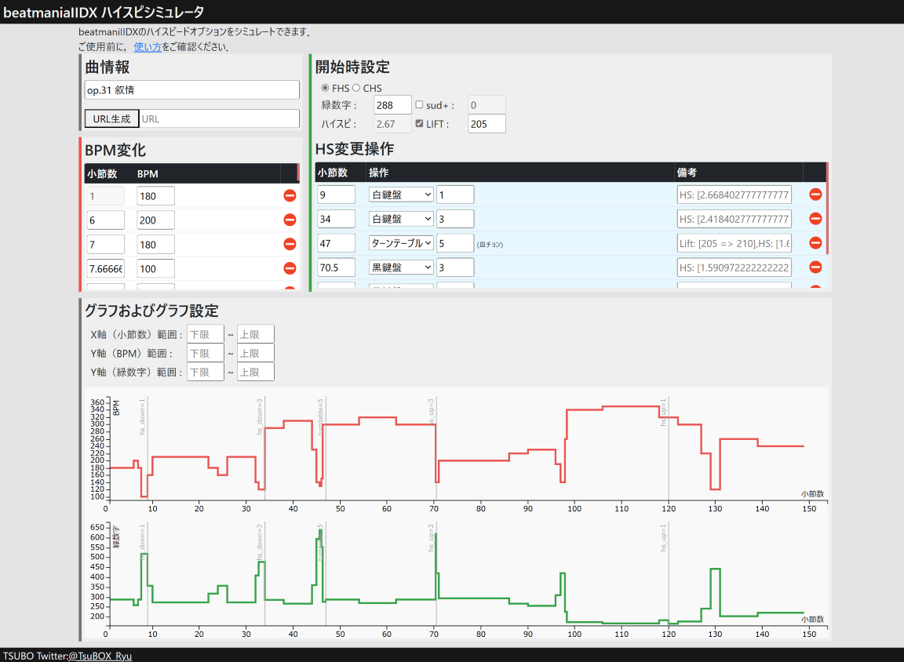
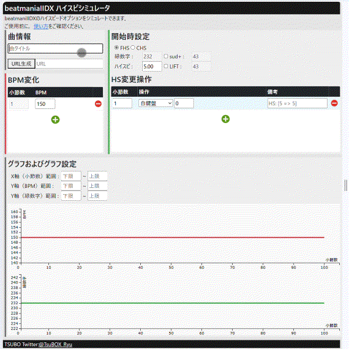
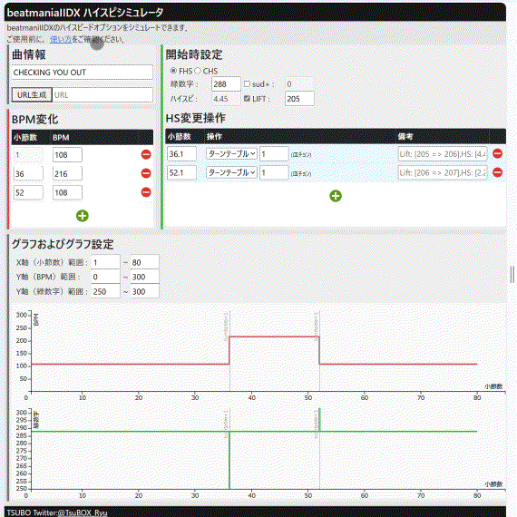

# beatmaniaIIDX High Speed Simulator

## Overview
beatmaniaIIDXのBPM変化および操作から，緑数字の変化を可視化できるシミュレーションサイトです．  
他のハイスピ計算機/シミュレータと比較して，以下の特徴があります : 
 - BPMおよび緑数字の変化が時系列グラフで表示されることで，ハイスピ変更操作のタイミングを検討しやすい．
 - 実際の操作と紐づいており，操作感がつかみやすい．
 - シミュレーション結果をURLパラメータとして出力でき，共有や保存ができる．

## Change log
 - 2024-09-25: メモ欄に表示する数値の桁数を調整
 - 2024-07-30: Sudden/Liftおよびハイスピードのグラフ表示/非表示機能を追加

## Usage
こちらのリンクから[シミュレーションサイト](https://tbx-ryu.github.io/FHS_sim/)へアクセスします．

### シミュレーション方法
本シミュレーションサイトは，以下のエリアから構成されます．
1. 曲情報エリア  
1. BPM情報エリア  
1. HS変更操作エリア
1. グラフエリア

#### 1. 曲情報エリア
曲タイトルや補足情報を記載します．　　
   

#### 2. BPM情報エリア
BPMの変化点を入力します．+ボタンをクリックして行を追加し，「BPMが変化する小節数」と「変化後のBPM」を入力します．入力すると入力値がグラフエリアに反映されます．また，1行目には開始時のBPMを入力します．  
   

#### 3. HS変更操作エリア
開始時のHS設定およびHS変更操作を入力します．  
   <u>開始時設定</u>：開始時のHS種別をFHSかCHSから選択します．また，Sudden+/Liftを使う場合は，それぞれのチェックボックスをクリックし白数字を入力します．FHSかつsud+かLiftにチェックが入っている場合は緑数字を，それ以外はハイスピードを入力します．
   
   
   
   <u>HS変更操作</u>：+ボタンをクリックして行を追加し，「HSの変更操作を行う小節数」と「操作内容」を入力します．操作内容はプルダウンメニューから選択し，操作によっては操作値を入力（以下の表を参照のこと）します．また，各行は
   「FHSの場合は青色」「CHSの場合は橙色」
   に色分けされます．
   
   | 操作内容 | 実際の操作 | 入力する値 |
   | :- | :- | :- |
   | 白鍵盤 | Start + 白鍵盤 | 鍵盤の押下回数 |
   | 黒鍵盤 | Start + 黒鍵盤 | 鍵盤の押下回数 |
   | Sud外し | Start 2回押し | - |
   | Sud付け | Start 2回押し | - |
   | ターンテーブル | Start + ターンテーブル | Sud/Lift使用時：白数字の差分   FHS+Sud/Lift未使用：HSの差分 |
   | HS切替 | Start + Effect | - |
   
   

#### 4. グラフエリア
グラフの表示範囲を入力します．

   

#### 5. シミュレーション結果の保存
シミュレーション結果を共有する/保存する場合は，曲情報エリアの「URL生成」ボタンをクリックし，URLを生成します．（生成されたURLにアクセスすると，保存時の状態のページが表示されます．）

   

### テンプレート
   以下のリンクからBPM変化を入力済みのシミュレータへアクセスできます．  
   （参考：[TexTage](https://textage.cc/)様）
   

   
…クリックで展開

   <!-- breakpoint -->
|Version|タイトル|
|:-|:-|
|CS|[CALDERA](https://tbx-ryu.github.io/FHS_sim/index.html?title=CALDERA&bpmkey=x-bpm&bpm=1s210r48.0s120r56.0s210&opkey=hsType-opType-opValue-x&op=t0so0s0s1&initkey=x-midori-memMidori-sud-lift-hid-hs-hasSud-sudInit-hasLift&init=1s232s232s0s0s0s5sfasfasfa)|
|CS|[Pluto](https://tbx-ryu.github.io/FHS_sim/index.html?title=Pluto&bpmkey=x-bpm&bpm=1s50r5.0s220r8.0s55r8.826086956521738s220r12.705882352941176s55r13.0s230r16.923076923076923s58r17.03448275862069s230r21.0s240r25.0s230r29.0s50r29.789473684210527s200r36.0s220r38.0s55r38.82608695652174s220r41.0s55r41.84615384615385s220r45.0s50r46.0s55r46.82608695652174s220r48.0s55r48.58620689655172s220r49.0s55r49.82608695652174s220r50.0s55r50.724137931034484s220r51.0s55r51.86206896551724s220r52.0s55r52.69230769230769s220r53.0s55r53.58620689655172s220r54.0s55r54.82608695652174s220r55.0s55r55.82608695652174s220r56.93333333333333s55r57.0s220r57.9s55r58.0s220r59.0s240r62.0s60r62.8s240r63.0s250r66.0s63r66.8s250r67.0s260r70.92307692307692s65r71.0s68r71.03448275862068s270&opkey=hsType-opType-opValue-x&op=t0so0s0s1&initkey=x-midori-memMidori-sud-lift-hid-hs-hasSud-sudInit-hasLift&init=1s232s232s0s0s0s5sfasfasfa)|
|CS|[SANA MOLLETE NE ENTE(B.L.T.STYLE)](https://tbx-ryu.github.io/FHS_sim/index.html?title=SANA%20MOLLETE%20NE%20ENTE%28B.L.T.STYLE%29&bpmkey=x-bpm&bpm=1s90r10.0s180&opkey=hsType-opType-opValue-x&op=t0so0s0s1&initkey=x-midori-memMidori-sud-lift-hid-hs-hasSud-sudInit-hasLift&init=1s232s232s0s0s0s5sfasfasfa)|
|CS|[STEP INTO THE NEW WORLD](https://tbx-ryu.github.io/FHS_sim/index.html?title=STEP%20INTO%20THE%20NEW%20WORLD&bpmkey=x-bpm&bpm=1s84r7.0s169r47.0s85r55.0s177&opkey=hsType-opType-opValue-x&op=t0so0s0s1&initkey=x-midori-memMidori-sud-lift-hid-hs-hasSud-sudInit-hasLift&init=1s232s232s0s0s0s5sfasfasfa)|
|CS|[The Least 100 sec](https://tbx-ryu.github.io/FHS_sim/index.html?title=The%20Least%20100%20sec&bpmkey=x-bpm&bpm=1s263r23.75s259r24.0s255r24.75s253r25.0s250r25.5s248r27.0s257r27.75s263r104.75s200&opkey=hsType-opType-opValue-x&op=t0so0s0s1&initkey=x-midori-memMidori-sud-lift-hid-hs-hasSud-sudInit-hasLift&init=1s232s232s0s0s0s5sfasfasfa)|
|1st Style|[e-motion](https://tbx-ryu.github.io/FHS_sim/index.html?title=e-motion&bpmkey=x-bpm&bpm=1s145r34.0s140&opkey=hsType-opType-opValue-x&op=t0so0s0s1&initkey=x-midori-memMidori-sud-lift-hid-hs-hasSud-sudInit-hasLift&init=1s232s232s0s0s0s5sfasfasfa)|
|1st Style|[GRADIUSIC CYBER](https://tbx-ryu.github.io/FHS_sim/index.html?title=GRADIUSIC%20CYBER&bpmkey=x-bpm&bpm=1s160r53.0s167r54.0s160&opkey=hsType-opType-opValue-x&op=t0so0s0s1&initkey=x-midori-memMidori-sud-lift-hid-hs-hasSud-sudInit-hasLift&init=1s232s232s0s0s0s5sfasfasfa)|
|1st Style|[ska a go go](https://tbx-ryu.github.io/FHS_sim/index.html?title=ska%20a%20go%20go&bpmkey=x-bpm&bpm=1s160r27.0s144r30.0s160&opkey=hsType-opType-opValue-x&op=t0so0s0s1&initkey=x-midori-memMidori-sud-lift-hid-hs-hasSud-sudInit-hasLift&init=1s232s232s0s0s0s5sfasfasfa)|
|substream|[NaHaNaHa vs. Gattchoon Battle](https://tbx-ryu.github.io/FHS_sim/index.html?title=NaHaNaHa%20vs.%20Gattchoon%20Battle&bpmkey=x-bpm&bpm=1s124r30.0s132r31.0s163&opkey=hsType-opType-opValue-x&op=t0so0s0s1&initkey=x-midori-memMidori-sud-lift-hid-hs-hasSud-sudInit-hasLift&init=1s232s232s0s0s0s5sfasfasfa)|
|2nd Style|[lovin' you](https://tbx-ryu.github.io/FHS_sim/index.html?title=lovin%27%20you&bpmkey=x-bpm&bpm=1s154r28.0s153r30.0s154r44.0s153r46.0s154&opkey=hsType-opType-opValue-x&op=t0so0s0s1&initkey=x-midori-memMidori-sud-lift-hid-hs-hasSud-sudInit-hasLift&init=1s232s232s0s0s0s5sfasfasfa)|
|2nd Style|[SOFT LANDING ON THE BODY](https://tbx-ryu.github.io/FHS_sim/index.html?title=SOFT%20LANDING%20ON%20THE%20BODY&bpmkey=x-bpm&bpm=1s160r40.0s318r41.0s80r45.0s160&opkey=hsType-opType-opValue-x&op=t0so0s0s1&initkey=x-midori-memMidori-sud-lift-hid-hs-hasSud-sudInit-hasLift&init=1s232s232s0s0s0s5sfasfasfa)|
|2nd Style|[S.O.S.](https://tbx-ryu.github.io/FHS_sim/index.html?title=S.O.S.&bpmkey=x-bpm&bpm=1s138r2.25s136r3.0s138&opkey=hsType-opType-opValue-x&op=t0so0s0s1&initkey=x-midori-memMidori-sud-lift-hid-hs-hasSud-sudInit-hasLift&init=1s232s232s0s0s0s5sfasfasfa)|
|2nd Style|[.59](https://tbx-ryu.github.io/FHS_sim/index.html?title=.59&bpmkey=x-bpm&bpm=1s134&opkey=hsType-opType-opValue-x&op=t0so0s0s1&initkey=x-midori-memMidori-sud-lift-hid-hs-hasSud-sudInit-hasLift&init=1s232s232s0s0s0s5sfasfasfa)|
|3rd Style|[era(nostalmix)](https://tbx-ryu.github.io/FHS_sim/index.html?title=era%28nostalmix%29&bpmkey=x-bpm&bpm=1s180r42.0s90r50.0s180r66.0s90&opkey=hsType-opType-opValue-x&op=t0so0s0s1&initkey=x-midori-memMidori-sud-lift-hid-hs-hasSud-sudInit-hasLift&init=1s232s232s0s0s0s5sfasfasfa)|
|4th Style|[ABSOLUTE](https://tbx-ryu.github.io/FHS_sim/index.html?title=ABSOLUTE&bpmkey=x-bpm&bpm=1s144r68.0s133r68.75s120r69.0s85r69.75s60&opkey=hsType-opType-opValue-x&op=t0so0s0s1&initkey=x-midori-memMidori-sud-lift-hid-hs-hasSud-sudInit-hasLift&init=1s232s232s0s0s0s5sfasfasfa)|
|4th Style|[ABSOLUTE†](https://tbx-ryu.github.io/FHS_sim/index.html?title=ABSOLUTE%E2%80%A0&bpmkey=x-bpm&bpm=1s144r68.0s133r68.75s120r69.0s85r69.75s60&opkey=hsType-opType-opValue-x&op=t0so0s0s1&initkey=x-midori-memMidori-sud-lift-hid-hs-hasSud-sudInit-hasLift&init=1s232s232s0s0s0s5sfasfasfa)|
|4th Style|[CHECKING YOU OUT](https://tbx-ryu.github.io/FHS_sim/index.html?title=CHECKING%20YOU%20OUT&bpmkey=x-bpm&bpm=1s108r36.0s216r52.0s108&opkey=hsType-opType-opValue-x&op=t0so0s0s1&initkey=x-midori-memMidori-sud-lift-hid-hs-hasSud-sudInit-hasLift&init=1s232s232s0s0s0s5sfasfasfa)|
|4th Style|[era(step mix)](https://tbx-ryu.github.io/FHS_sim/index.html?title=era%28step%20mix%29&bpmkey=x-bpm&bpm=1s180r42.0s90r50.0s180r66.0s90&opkey=hsType-opType-opValue-x&op=t0so0s0s1&initkey=x-midori-memMidori-sud-lift-hid-hs-hasSud-sudInit-hasLift&init=1s232s232s0s0s0s5sfasfasfa)|
|4th Style|[FLOWERS for ALBION](https://tbx-ryu.github.io/FHS_sim/index.html?title=FLOWERS%20for%20ALBION&bpmkey=x-bpm&bpm=1s80r2.0s93r3.75s84r4.0s93r6.75s90r7.0s93r8.75s79r9.0s85r9.75s70r10.0s93r12.75s85r13.0s93r13.75s84r14.0s93r15.75s85r16.0s93&opkey=hsType-opType-opValue-x&op=t0so0s0s1&initkey=x-midori-memMidori-sud-lift-hid-hs-hasSud-sudInit-hasLift&init=1s232s232s0s0s0s5sfasfasfa)|
|4th Style|[R壱萬](https://tbx-ryu.github.io/FHS_sim/index.html?title=R%E5%A3%B1%E8%90%AC&bpmkey=x-bpm&bpm=1s190r16.0s191r16.5s192r17.0s193r17.5s194r18.0s195r18.5s196r19.0s197r19.5s198r20.5s199r21.0s196r21.5s195r22.0s194r22.5s193r23.0s192r23.5s191r24.0s190r24.5s189r25.0s188r34.5s189r35.0s190r35.5s191r36.0s192r36.5s193r37.0s194r37.5s195r38.0s196r46.0s197r46.5s198r47.0s199r47.5s200r48.0s201r48.5s202r49.0s203r49.5s204r66.0s197r66.5s198r67.0s199r67.5s200r68.0s201r68.5s202r69.0s203r69.5s204&opkey=hsType-opType-opValue-x&op=t0so0s0s1&initkey=x-midori-memMidori-sud-lift-hid-hs-hasSud-sudInit-hasLift&init=1s232s232s0s0s0s5sfasfasfa)|
|4th Style|[Twin Bee(Generation X)](https://tbx-ryu.github.io/FHS_sim/index.html?title=Twin%20Bee%28Generation%20X%29&bpmkey=x-bpm&bpm=1s169r5.0s177r6.0s169&opkey=hsType-opType-opValue-x&op=t0so0s0s1&initkey=x-midori-memMidori-sud-lift-hid-hs-hasSud-sudInit-hasLift&init=1s232s232s0s0s0s5sfasfasfa)|
|4th Style|[Voltage(feat. Hidemaru)](https://tbx-ryu.github.io/FHS_sim/index.html?title=Voltage%28feat.%20Hidemaru%29&bpmkey=x-bpm&bpm=1s125r14.0s30r14.066666666666666s125r16.0s30r16.066666666666666s125r18.0s30r18.066666666666666s125r20.0s30r20.066666666666666s125r22.0s30r22.066666666666666s125r24.0s30r24.066666666666666s125&opkey=hsType-opType-opValue-x&op=t0so0s0s1&initkey=x-midori-memMidori-sud-lift-hid-hs-hasSud-sudInit-hasLift&init=1s232s232s0s0s0s5sfasfasfa)|
|5th Style|[INSERTiON](https://tbx-ryu.github.io/FHS_sim/index.html?title=INSERTiON&bpmkey=x-bpm&bpm=1s139r26.0s129r27.0s114r27.75s116r28.0s122r28.75s124r29.0s130r29.75s132r30.0s138r30.75s140r31.0s134r31.75s132r32.0s122r32.75s118r33.0s130r33.75s134r34.0s146r34.75s150r35.0s139r55.0s180r55.75s185r56.0s200r56.75s205r57.0s220r57.75s225&opkey=hsType-opType-opValue-x&op=t0so0s0s1&initkey=x-midori-memMidori-sud-lift-hid-hs-hasSud-sudInit-hasLift&init=1s232s232s0s0s0s5sfasfasfa)|
|5th Style|[OVER THE CLOUDS](https://tbx-ryu.github.io/FHS_sim/index.html?title=OVER%20THE%20CLOUDS&bpmkey=x-bpm&bpm=1s128r35.0s125r38.75s120r39.0s128&opkey=hsType-opType-opValue-x&op=t0so0s0s1&initkey=x-midori-memMidori-sud-lift-hid-hs-hasSud-sudInit-hasLift&init=1s232s232s0s0s0s5sfasfasfa)|
|5th Style|[Regulus](https://tbx-ryu.github.io/FHS_sim/index.html?title=Regulus&bpmkey=x-bpm&bpm=1s128r35.0s125r38.75s120r39.0s128&opkey=hsType-opType-opValue-x&op=t0so0s0s1&initkey=x-midori-memMidori-sud-lift-hid-hs-hasSud-sudInit-hasLift&init=1s232s232s0s0s0s5sfasfasfa)|
|5th Style|[Remember You](https://tbx-ryu.github.io/FHS_sim/index.html?title=Remember%20You&bpmkey=x-bpm&bpm=1s105r40.0s99r40.75s97r41.0s75r41.75s60&opkey=hsType-opType-opValue-x&op=t0so0s0s1&initkey=x-midori-memMidori-sud-lift-hid-hs-hasSud-sudInit-hasLift&init=1s232s232s0s0s0s5sfasfasfa)|
|6th Style|[L'amour et la libert&eacute;](https://tbx-ryu.github.io/FHS_sim/index.html?title=L%27amour%20et%20la%20libert%26eacute%3B&bpmkey=x-bpm&bpm=1s145r14.0s140r22.0s145r46.0s140r54.0s145&opkey=hsType-opType-opValue-x&op=t0so0s0s1&initkey=x-midori-memMidori-sud-lift-hid-hs-hasSud-sudInit-hasLift&init=1s232s232s0s0s0s5sfasfasfa)|
|6th Style|[Linus](https://tbx-ryu.github.io/FHS_sim/index.html?title=Linus&bpmkey=x-bpm&bpm=1s176r14.75s160r15.0s176r31.0s172r39.0s168r55.0s170r58.0s171r58.75s172r59.0s176r59.8s166r60.0s176&opkey=hsType-opType-opValue-x&op=t0so0s0s1&initkey=x-midori-memMidori-sud-lift-hid-hs-hasSud-sudInit-hasLift&init=1s232s232s0s0s0s5sfasfasfa)|
|6th Style|[VJ ARMY](https://tbx-ryu.github.io/FHS_sim/index.html?title=VJ%20ARMY&bpmkey=x-bpm&bpm=1s141r18.0s145r36.0s160r54.0s135&opkey=hsType-opType-opValue-x&op=t0so0s0s1&initkey=x-midori-memMidori-sud-lift-hid-hs-hasSud-sudInit-hasLift&init=1s232s232s0s0s0s5sfasfasfa)|
|7th Style|[A](https://tbx-ryu.github.io/FHS_sim/index.html?title=A&bpmkey=x-bpm&bpm=1s93r23.5s191&opkey=hsType-opType-opValue-x&op=t0so0s0s1&initkey=x-midori-memMidori-sud-lift-hid-hs-hasSud-sudInit-hasLift&init=1s232s232s0s0s0s5sfasfasfa)|
|7th Style|[Glorious Days](https://tbx-ryu.github.io/FHS_sim/index.html?title=Glorious%20Days&bpmkey=x-bpm&bpm=1s82r26.833333333333332s83r30.666666666666668s80r31.75s81r35.4s79r36.0s78r37.0s59r37.833333333333336s49r38.0s40&opkey=hsType-opType-opValue-x&op=t0so0s0s1&initkey=x-midori-memMidori-sud-lift-hid-hs-hasSud-sudInit-hasLift&init=1s232s232s0s0s0s5sfasfasfa)|
|7th Style|[MAX 300](https://tbx-ryu.github.io/FHS_sim/index.html?title=MAX%20300&bpmkey=x-bpm&bpm=1s300r73.0s12r73.7s300&opkey=hsType-opType-opValue-x&op=t0so0s0s1&initkey=x-midori-memMidori-sud-lift-hid-hs-hasSud-sudInit-hasLift&init=1s232s232s0s0s0s5sfasfasfa)|
|7th Style|[Spooky](https://tbx-ryu.github.io/FHS_sim/index.html?title=Spooky&bpmkey=x-bpm&bpm=1s140r70.0s455r70.984375s140&opkey=hsType-opType-opValue-x&op=t0so0s0s1&initkey=x-midori-memMidori-sud-lift-hid-hs-hasSud-sudInit-hasLift&init=1s232s232s0s0s0s5sfasfasfa)|
|7th Style|[革命](https://tbx-ryu.github.io/FHS_sim/index.html?title=%E9%9D%A9%E5%91%BD&bpmkey=x-bpm&bpm=1s148r7.5s141r8.0s143r9.0s110r9.75s83r10.0s137r10.75s148&opkey=hsType-opType-opValue-x&op=t0so0s0s1&initkey=x-midori-memMidori-sud-lift-hid-hs-hasSud-sudInit-hasLift&init=1s232s232s0s0s0s5sfasfasfa)|
|8th Style|[airflow](https://tbx-ryu.github.io/FHS_sim/index.html?title=airflow&bpmkey=x-bpm&bpm=1s148r63.0s142r64.0s137r65.0s118r65.75s105r66.0s95r66.75s75&opkey=hsType-opType-opValue-x&op=t0so0s0s1&initkey=x-midori-memMidori-sud-lift-hid-hs-hasSud-sudInit-hasLift&init=1s232s232s0s0s0s5sfasfasfa)|
|8th Style|[DANCER](https://tbx-ryu.github.io/FHS_sim/index.html?title=DANCER&bpmkey=x-bpm&bpm=1s145r2.0s149&opkey=hsType-opType-opValue-x&op=t0so0s0s1&initkey=x-midori-memMidori-sud-lift-hid-hs-hasSud-sudInit-hasLift&init=1s232s232s0s0s0s5sfasfasfa)|
|8th Style|[dual control](https://tbx-ryu.github.io/FHS_sim/index.html?title=dual%20control&bpmkey=x-bpm&bpm=1s131r1.875s140&opkey=hsType-opType-opValue-x&op=t0so0s0s1&initkey=x-midori-memMidori-sud-lift-hid-hs-hasSud-sudInit-hasLift&init=1s232s232s0s0s0s5sfasfasfa)|
|8th Style|[桜](https://tbx-ryu.github.io/FHS_sim/index.html?title=%E6%A1%9C&bpmkey=x-bpm&bpm=1s300r50.0s150r52.0s135r52.75s127r53.0s44r53.875s13r54.0s150r62.0s320r103.0s300r103.5s270r104.0s220r104.75s170&opkey=hsType-opType-opValue-x&op=t0so0s0s1&initkey=x-midori-memMidori-sud-lift-hid-hs-hasSud-sudInit-hasLift&init=1s232s232s0s0s0s5sfasfasfa)|
|9th Style|[Cradle](https://tbx-ryu.github.io/FHS_sim/index.html?title=Cradle&bpmkey=x-bpm&bpm=1s160r45.0s188&opkey=hsType-opType-opValue-x&op=t0so0s0s1&initkey=x-midori-memMidori-sud-lift-hid-hs-hasSud-sudInit-hasLift&init=1s232s232s0s0s0s5sfasfasfa)|
|9th Style|[fun](https://tbx-ryu.github.io/FHS_sim/index.html?title=fun&bpmkey=x-bpm&bpm=1s100r26.142857142857142s200r41.666666666666664s100r45.6s200r48.0s100&opkey=hsType-opType-opValue-x&op=t0so0s0s1&initkey=x-midori-memMidori-sud-lift-hid-hs-hasSud-sudInit-hasLift&init=1s232s232s0s0s0s5sfasfasfa)|
|9th Style|[moon_child](https://tbx-ryu.github.io/FHS_sim/index.html?title=moon_child&bpmkey=x-bpm&bpm=1s146r4.0s150r6.0s155r10.0s160r74.0s155r80.0s150&opkey=hsType-opType-opValue-x&op=t0so0s0s1&initkey=x-midori-memMidori-sud-lift-hid-hs-hasSud-sudInit-hasLift&init=1s232s232s0s0s0s5sfasfasfa)|
|9th Style|[PARANOIA survivor MAX](https://tbx-ryu.github.io/FHS_sim/index.html?title=PARANOIA%20survivor%20MAX&bpmkey=x-bpm&bpm=1s290r24.0s145r25.0s290r39.0s145r40.0s290r45.5s145r46.5s290r65.0s73r66.0s290r96.0s145r97.0s290&opkey=hsType-opType-opValue-x&op=t0so0s0s1&initkey=x-midori-memMidori-sud-lift-hid-hs-hasSud-sudInit-hasLift&init=1s232s232s0s0s0s5sfasfasfa)|
|9th Style|[Prelude](https://tbx-ryu.github.io/FHS_sim/index.html?title=Prelude&bpmkey=x-bpm&bpm=1s140r25.0s135r31.0s138r32.0s140&opkey=hsType-opType-opValue-x&op=t0so0s0s1&initkey=x-midori-memMidori-sud-lift-hid-hs-hasSud-sudInit-hasLift&init=1s232s232s0s0s0s5sfasfasfa)|
|10th Style|[1st Samurai](https://tbx-ryu.github.io/FHS_sim/index.html?title=1st%20Samurai&bpmkey=x-bpm&bpm=1s175r69.0s200&opkey=hsType-opType-opValue-x&op=t0so0s0s1&initkey=x-midori-memMidori-sud-lift-hid-hs-hasSud-sudInit-hasLift&init=1s232s232s0s0s0s5sfasfasfa)|
|10th Style|[A-JAX (3-WAY MIX)](https://tbx-ryu.github.io/FHS_sim/index.html?title=A-JAX%20%283-WAY%20MIX%29&bpmkey=x-bpm&bpm=1s62r2.0s224r50.0s174r75.0s154r97.0s148&opkey=hsType-opType-opValue-x&op=t0so0s0s1&initkey=x-midori-memMidori-sud-lift-hid-hs-hasSud-sudInit-hasLift&init=1s232s232s0s0s0s5sfasfasfa)|
|10th Style|[GRADIUS -FULL SPEED-](https://tbx-ryu.github.io/FHS_sim/index.html?title=GRADIUS%20-FULL%20SPEED-&bpmkey=x-bpm&bpm=1s160r51.833333333333336s220r61.75s160r67.0s220r70.5s160r71.0s200&opkey=hsType-opType-opValue-x&op=t0so0s0s1&initkey=x-midori-memMidori-sud-lift-hid-hs-hasSud-sudInit-hasLift&init=1s232s232s0s0s0s5sfasfasfa)|
|10th Style|[JAM](https://tbx-ryu.github.io/FHS_sim/index.html?title=JAM&bpmkey=x-bpm&bpm=1s225r107.0s207r107.75s200r108.0s188r108.5s175r109.0s130r109.75s71&opkey=hsType-opType-opValue-x&op=t0so0s0s1&initkey=x-midori-memMidori-sud-lift-hid-hs-hasSud-sudInit-hasLift&init=1s232s232s0s0s0s5sfasfasfa)|
|IIDXRED|[Close my Eyes for Me](https://tbx-ryu.github.io/FHS_sim/index.html?title=Close%20my%20Eyes%20for%20Me&bpmkey=x-bpm&bpm=1s132r51.0s145&opkey=hsType-opType-opValue-x&op=t0so0s0s1&initkey=x-midori-memMidori-sud-lift-hid-hs-hasSud-sudInit-hasLift&init=1s232s232s0s0s0s5sfasfasfa)|
|IIDXRED|[earth scape](https://tbx-ryu.github.io/FHS_sim/index.html?title=earth%20scape&bpmkey=x-bpm&bpm=1s94r5.0s91r5.75s88r6.75s84r7.0s90r7.25s94r8.75s89r9.0s94r10.0s91r10.75s88r11.0s94r14.0s89r14.75s85r15.0s94r18.75s84r19.0s94r21.75s88r22.75s87r23.0s80r23.75s94r39.0s91r39.75s87r40.0s93r44.0s92r45.0s90r46.0s71r46.75s45r47.0s94&opkey=hsType-opType-opValue-x&op=t0so0s0s1&initkey=x-midori-memMidori-sud-lift-hid-hs-hasSud-sudInit-hasLift&init=1s232s232s0s0s0s5sfasfasfa)|
|IIDXRED|[Move Me](https://tbx-ryu.github.io/FHS_sim/index.html?title=Move%20Me&bpmkey=x-bpm&bpm=1s186r12.0s93r46.0s186&opkey=hsType-opType-opValue-x&op=t0so0s0s1&initkey=x-midori-memMidori-sud-lift-hid-hs-hasSud-sudInit-hasLift&init=1s232s232s0s0s0s5sfasfasfa)|
|IIDXRED|[NEBULA GRASPER](https://tbx-ryu.github.io/FHS_sim/index.html?title=NEBULA%20GRASPER&bpmkey=x-bpm&bpm=1s152r3.0s153&opkey=hsType-opType-opValue-x&op=t0so0s0s1&initkey=x-midori-memMidori-sud-lift-hid-hs-hasSud-sudInit-hasLift&init=1s232s232s0s0s0s5sfasfasfa)|
|IIDXRED|[大桟橋](https://tbx-ryu.github.io/FHS_sim/index.html?title=%E5%A4%A7%E6%A1%9F%E6%A9%8B&bpmkey=x-bpm&bpm=1s84r22.0s168&opkey=hsType-opType-opValue-x&op=t0so0s0s1&initkey=x-midori-memMidori-sud-lift-hid-hs-hasSud-sudInit-hasLift&init=1s232s232s0s0s0s5sfasfasfa)|
|IIDXRED|[ピアノ協奏曲第１番"蠍火"](https://tbx-ryu.github.io/FHS_sim/index.html?title=%E3%83%94%E3%82%A2%E3%83%8E%E5%8D%94%E5%A5%8F%E6%9B%B2%E7%AC%AC%EF%BC%91%E7%95%AA%22%E8%A0%8D%E7%81%AB%22&bpmkey=x-bpm&bpm=1s185r44.0s165r44.5s177r45.0s184r52.0s180r53.0s168r53.5s173r54.0s174r56.0s178r56.75s179r57.0s184r62.0s186r66.0s188r67.5s178r68.0s179r73.0s182r74.0s188r80.0s180&opkey=hsType-opType-opValue-x&op=t0so0s0s1&initkey=x-midori-memMidori-sud-lift-hid-hs-hasSud-sudInit-hasLift&init=1s232s232s0s0s0s5sfasfasfa)|
|HAPPYSKY|[Agnus Dei](https://tbx-ryu.github.io/FHS_sim/index.html?title=Agnus%20Dei&bpmkey=x-bpm&bpm=1s168r7.0s150r7.5s70r8.0s168r70.0s150r71.0s168r97.0s160&opkey=hsType-opType-opValue-x&op=t0so0s0s1&initkey=x-midori-memMidori-sud-lift-hid-hs-hasSud-sudInit-hasLift&init=1s232s232s0s0s0s5sfasfasfa)|
|HAPPYSKY|[Little Little Princess†](https://tbx-ryu.github.io/FHS_sim/index.html?title=Little%20Little%20Princess%E2%80%A0&bpmkey=x-bpm&bpm=1s212r115.0s180&opkey=hsType-opType-opValue-x&op=t0so0s0s1&initkey=x-midori-memMidori-sud-lift-hid-hs-hasSud-sudInit-hasLift&init=1s232s232s0s0s0s5sfasfasfa)|
|HAPPYSKY|[Little Little Princess](https://tbx-ryu.github.io/FHS_sim/index.html?title=Little%20Little%20Princess&bpmkey=x-bpm&bpm=1s212r115.0s180&opkey=hsType-opType-opValue-x&op=t0so0s0s1&initkey=x-midori-memMidori-sud-lift-hid-hs-hasSud-sudInit-hasLift&init=1s232s232s0s0s0s5sfasfasfa)|
|HAPPYSKY|[mind the gap](https://tbx-ryu.github.io/FHS_sim/index.html?title=mind%20the%20gap&bpmkey=x-bpm&bpm=1s98r18.0s147r26.0s98r30.0s147r34.0s98&opkey=hsType-opType-opValue-x&op=t0so0s0s1&initkey=x-midori-memMidori-sud-lift-hid-hs-hasSud-sudInit-hasLift&init=1s232s232s0s0s0s5sfasfasfa)|
|HAPPYSKY|[Pink Rose](https://tbx-ryu.github.io/FHS_sim/index.html?title=Pink%20Rose&bpmkey=x-bpm&bpm=1s132r10.0s120r10.75s116r12.0s146&opkey=hsType-opType-opValue-x&op=t0so0s0s1&initkey=x-midori-memMidori-sud-lift-hid-hs-hasSud-sudInit-hasLift&init=1s232s232s0s0s0s5sfasfasfa)|
|HAPPYSKY|[TOE JAM](https://tbx-ryu.github.io/FHS_sim/index.html?title=TOE%20JAM&bpmkey=x-bpm&bpm=1s90r6.0s112r14.0s132r39.0s160r65.5s150&opkey=hsType-opType-opValue-x&op=t0so0s0s1&initkey=x-midori-memMidori-sud-lift-hid-hs-hasSud-sudInit-hasLift&init=1s232s232s0s0s0s5sfasfasfa)|
|HAPPYSKY|[Votum stellarum](https://tbx-ryu.github.io/FHS_sim/index.html?title=Votum%20stellarum&bpmkey=x-bpm&bpm=1s136r6.0s147&opkey=hsType-opType-opValue-x&op=t0so0s0s1&initkey=x-midori-memMidori-sud-lift-hid-hs-hasSud-sudInit-hasLift&init=1s232s232s0s0s0s5sfasfasfa)|
|HAPPYSKY|[冥](https://tbx-ryu.github.io/FHS_sim/index.html?title=%E5%86%A5&bpmkey=x-bpm&bpm=1s200r52.0s100r56.0s110r57.0s120r58.0s130r59.0s140r60.0s150r61.0s160r62.0s170r63.0s180r64.0s190r65.0s200r94.5s180r95.0s175r96.0s140r96.75s100&opkey=hsType-opType-opValue-x&op=t0so0s0s1&initkey=x-midori-memMidori-sud-lift-hid-hs-hasSud-sudInit-hasLift&init=1s232s232s0s0s0s5sfasfasfa)|
|HAPPYSKY|[ラクエン](https://tbx-ryu.github.io/FHS_sim/index.html?title=%E3%83%A9%E3%82%AF%E3%82%A8%E3%83%B3&bpmkey=x-bpm&bpm=1s99r30.0s198r48.0s99&opkey=hsType-opType-opValue-x&op=t0so0s0s1&initkey=x-midori-memMidori-sud-lift-hid-hs-hasSud-sudInit-hasLift&init=1s232s232s0s0s0s5sfasfasfa)|
|HAPPYSKY|[キャッシュレスは愛情消すティッシュ](https://tbx-ryu.github.io/FHS_sim/index.html?title=%E3%82%AD%E3%83%A3%E3%83%83%E3%82%B7%E3%83%A5%E3%83%AC%E3%82%B9%E3%81%AF%E6%84%9B%E6%83%85%E6%B6%88%E3%81%99%E3%83%86%E3%82%A3%E3%83%83%E3%82%B7%E3%83%A5&bpmkey=x-bpm&bpm=1s117r11.0s170&opkey=hsType-opType-opValue-x&op=t0so0s0s1&initkey=x-midori-memMidori-sud-lift-hid-hs-hasSud-sudInit-hasLift&init=1s232s232s0s0s0s5sfasfasfa)|
|DistorteD|[Concertino in Blue](https://tbx-ryu.github.io/FHS_sim/index.html?title=Concertino%20in%20Blue&bpmkey=x-bpm&bpm=1s140r8.0s155r15.333333333333334s153r16.0s151r18.666666666666668s155r24.333333333333332s153r25.0s151r28.0s155r49.0s154r49.666666666666664s141r50.0s155r70.0s139r70.66666666666667s128r71.0s122r73.0s112r73.66666666666667s103&opkey=hsType-opType-opValue-x&op=t0so0s0s1&initkey=x-midori-memMidori-sud-lift-hid-hs-hasSud-sudInit-hasLift&init=1s232s232s0s0s0s5sfasfasfa)|
|DistorteD|[Ganymede](https://tbx-ryu.github.io/FHS_sim/index.html?title=Ganymede&bpmkey=x-bpm&bpm=1s82r42.0s75r42.75s72r43.0s78&opkey=hsType-opType-opValue-x&op=t0so0s0s1&initkey=x-midori-memMidori-sud-lift-hid-hs-hasSud-sudInit-hasLift&init=1s232s232s0s0s0s5sfasfasfa)|
|GOLD|[2hot2eat](https://tbx-ryu.github.io/FHS_sim/index.html?title=2hot2eat&bpmkey=x-bpm&bpm=1s140r48.0s143r50.0s146r52.0s149r54.0s152r56.0s155r59.5s149r61.0s140&opkey=hsType-opType-opValue-x&op=t0so0s0s1&initkey=x-midori-memMidori-sud-lift-hid-hs-hasSud-sudInit-hasLift&init=1s232s232s0s0s0s5sfasfasfa)|
|GOLD|[Blind Justice 〜Torn souls, Hurt Faiths〜](https://tbx-ryu.github.io/FHS_sim/index.html?title=Blind%20Justice%20%E3%80%9CTorn%20souls%2C%20Hurt%20Faiths%E3%80%9C&bpmkey=x-bpm&bpm=1s165r84.0s156r84.5s137&opkey=hsType-opType-opValue-x&op=t0so0s0s1&initkey=x-midori-memMidori-sud-lift-hid-hs-hasSud-sudInit-hasLift&init=1s232s232s0s0s0s5sfasfasfa)|
|GOLD|[Fascination MAXX](https://tbx-ryu.github.io/FHS_sim/index.html?title=Fascination%20MAXX&bpmkey=x-bpm&bpm=1s100r7.0s400r23.0s200r23.5s400r27.0s200r27.75s400r30.75s200r31.0s400r35.0s200r35.5s400r38.0s100r42.0s200r66.0s100r67.0s200r71.0s400r99.0s100r100.0s200r102.0s400&opkey=hsType-opType-opValue-x&op=t0so0s0s1&initkey=x-midori-memMidori-sud-lift-hid-hs-hasSud-sudInit-hasLift&init=1s232s232s0s0s0s5sfasfasfa)|
|GOLD|[op.31 叙情](https://tbx-ryu.github.io/FHS_sim/index.html?title=op.31%20%E5%8F%99%E6%83%85&bpmkey=x-bpm&bpm=1s180r6.0s200r7.0s180r7.666666666666667s100r9.0s160r10.0s210r22.0s180r24.0s160r26.0s210r32.0s140r32.666666666666664s120r34.0s290r38.0s310r44.0s230r45.0s140r45.666666666666664s130r46.0s150r46.333333333333336s300r54.0s320r62.0s300r70.33333333333333s140r71.0s200r86.0s220r90.0s230r96.0s190r97.0s140r98.0s260r98.33333333333333s340r106.0s350r118.0s320r122.0s300r127.0s220r129.0s120r131.0s260r139.0s240r143.0s130&opkey=hsType-opType-opValue-x&op=t0so0s0s1&initkey=x-midori-memMidori-sud-lift-hid-hs-hasSud-sudInit-hasLift&init=1s232s232s0s0s0s5sfasfasfa)|
|GOLD|[TRANOID](https://tbx-ryu.github.io/FHS_sim/index.html?title=TRANOID&bpmkey=x-bpm&bpm=1s130r23.0s180r24.0s185r25.0s190&opkey=hsType-opType-opValue-x&op=t0so0s0s1&initkey=x-midori-memMidori-sud-lift-hid-hs-hasSud-sudInit-hasLift&init=1s232s232s0s0s0s5sfasfasfa)|
|TROOPERS|[avant-guerre](https://tbx-ryu.github.io/FHS_sim/index.html?title=avant-guerre&bpmkey=x-bpm&bpm=1s146r47.0s130r59.0s146&opkey=hsType-opType-opValue-x&op=t0so0s0s1&initkey=x-midori-memMidori-sud-lift-hid-hs-hasSud-sudInit-hasLift&init=1s232s232s0s0s0s5sfasfasfa)|
|TROOPERS|[four pieces of heaven](https://tbx-ryu.github.io/FHS_sim/index.html?title=four%20pieces%20of%20heaven&bpmkey=x-bpm&bpm=1s195r48.0s175r52.0s168r54.0s160r55.0s135r56.0s125r58.0s130r60.0s135r62.0s140r64.0s145r66.0s150r68.0s160r69.0s170r70.0s180r71.0s195&opkey=hsType-opType-opValue-x&op=t0so0s0s1&initkey=x-midori-memMidori-sud-lift-hid-hs-hasSud-sudInit-hasLift&init=1s232s232s0s0s0s5sfasfasfa)|
|TROOPERS|[ICARUS](https://tbx-ryu.github.io/FHS_sim/index.html?title=ICARUS&bpmkey=x-bpm&bpm=1s176r44.0s126r53.0s131r55.0s136r57.0s141r58.0s146r59.0s151r60.0s156r61.0s161r62.0s166r63.0s171r64.0s176r65.0s181r65.5s186r66.0s191r66.5s196r67.0s201r68.0s211r69.0s221r70.0s231r71.0s241r72.0s251r73.0s176&opkey=hsType-opType-opValue-x&op=t0so0s0s1&initkey=x-midori-memMidori-sud-lift-hid-hs-hasSud-sudInit-hasLift&init=1s232s232s0s0s0s5sfasfasfa)|
|TROOPERS|[ICARUS†](https://tbx-ryu.github.io/FHS_sim/index.html?title=ICARUS%E2%80%A0&bpmkey=x-bpm&bpm=1s176r44.0s126r53.0s131r55.0s136r57.0s141r58.0s146r59.0s151r60.0s156r61.0s161r62.0s166r63.0s171r64.0s176r65.0s181r65.5s186r66.0s191r66.5s196r67.0s201r68.0s211r69.0s221r70.0s231r71.0s241r72.0s251r73.0s176&opkey=hsType-opType-opValue-x&op=t0so0s0s1&initkey=x-midori-memMidori-sud-lift-hid-hs-hasSud-sudInit-hasLift&init=1s232s232s0s0s0s5sfasfasfa)|
|TROOPERS|[PARANOiA 〜HADES〜](https://tbx-ryu.github.io/FHS_sim/index.html?title=PARANOiA%20%E3%80%9CHADES%E3%80%9C&bpmkey=x-bpm&bpm=1s300r68.0s75r70.0s150r86.0s300&opkey=hsType-opType-opValue-x&op=t0so0s0s1&initkey=x-midori-memMidori-sud-lift-hid-hs-hasSud-sudInit-hasLift&init=1s232s232s0s0s0s5sfasfasfa)|
|TROOPERS|[TRIP MACHINE PhoeniX](https://tbx-ryu.github.io/FHS_sim/index.html?title=TRIP%20MACHINE%20PhoeniX&bpmkey=x-bpm&bpm=1s160r58.0s80r59.0s160&opkey=hsType-opType-opValue-x&op=t0so0s0s1&initkey=x-midori-memMidori-sud-lift-hid-hs-hasSud-sudInit-hasLift&init=1s232s232s0s0s0s5sfasfasfa)|
|TROOPERS|[少年A](https://tbx-ryu.github.io/FHS_sim/index.html?title=%E5%B0%91%E5%B9%B4A&bpmkey=x-bpm&bpm=1s90r28.0s192r77.0s185r78.0s179&opkey=hsType-opType-opValue-x&op=t0so0s0s1&initkey=x-midori-memMidori-sud-lift-hid-hs-hasSud-sudInit-hasLift&init=1s232s232s0s0s0s5sfasfasfa)|
|TROOPERS|[走馬灯 -The Last Song-](https://tbx-ryu.github.io/FHS_sim/index.html?title=%E8%B5%B0%E9%A6%AC%E7%81%AF%20-The%20Last%20Song-&bpmkey=x-bpm&bpm=1s85r14.0s83r14.75s81r15.0s85r32.0s78r32.75s68r33.0s84r34.0s85r44.75s81r45.0s77r45.75s73&opkey=hsType-opType-opValue-x&op=t0so0s0s1&initkey=x-midori-memMidori-sud-lift-hid-hs-hasSud-sudInit-hasLift&init=1s232s232s0s0s0s5sfasfasfa)|
|EMPRESS|[Marie Antoinette](https://tbx-ryu.github.io/FHS_sim/index.html?title=Marie%20Antoinette&bpmkey=x-bpm&bpm=1s215r40.0s205r134.0s248&opkey=hsType-opType-opValue-x&op=t0so0s0s1&initkey=x-midori-memMidori-sud-lift-hid-hs-hasSud-sudInit-hasLift&init=1s232s232s0s0s0s5sfasfasfa)|
|EMPRESS|[THANK YOU FOR PLAYING](https://tbx-ryu.github.io/FHS_sim/index.html?title=THANK%20YOU%20FOR%20PLAYING&bpmkey=x-bpm&bpm=1s170r69.0s145r69.75s140r70.0s99r70.75s45&opkey=hsType-opType-opValue-x&op=t0so0s0s1&initkey=x-midori-memMidori-sud-lift-hid-hs-hasSud-sudInit-hasLift&init=1s232s232s0s0s0s5sfasfasfa)|
|EMPRESS|[THANK YOU FOR PLAYING†](https://tbx-ryu.github.io/FHS_sim/index.html?title=THANK%20YOU%20FOR%20PLAYING%E2%80%A0&bpmkey=x-bpm&bpm=1s170r69.0s145r69.75s140r70.0s99r70.75s45&opkey=hsType-opType-opValue-x&op=t0so0s0s1&initkey=x-midori-memMidori-sud-lift-hid-hs-hasSud-sudInit-hasLift&init=1s232s232s0s0s0s5sfasfasfa)|
|EMPRESS|[Y&Co. is dead or alive](https://tbx-ryu.github.io/FHS_sim/index.html?title=Y%26Co.%20is%20dead%20or%20alive&bpmkey=x-bpm&bpm=1s145r51.0s154r51.75s163r52.0s175r52.75s178r53.0s194r53.75s204r54.0s221r54.75s240r55.0s265r55.75s290r56.0s300r56.75s325r57.0s350r57.75s392r58.0s388r58.75s510r59.0s468r59.75s540r62.0s694r62.5s822r63.0s840r63.75s876r75.0s145&opkey=hsType-opType-opValue-x&op=t0so0s0s1&initkey=x-midori-memMidori-sud-lift-hid-hs-hasSud-sudInit-hasLift&init=1s232s232s0s0s0s5sfasfasfa)|
|EMPRESS|[Y&amp;Co. is dead or alive](https://tbx-ryu.github.io/FHS_sim/index.html?title=Y%26amp%3BCo.%20is%20dead%20or%20alive&bpmkey=x-bpm&bpm=1s145r51.0s154r51.75s163r52.0s175r52.75s178r53.0s194r53.75s204r54.0s221r54.75s240r55.0s265r55.75s290r56.0s300r56.75s325r57.0s350r57.75s392r58.0s388r58.75s510r59.0s468r59.75s540r62.0s694r62.5s822r63.0s840r63.75s876r75.0s145&opkey=hsType-opType-opValue-x&op=t0so0s0s1&initkey=x-midori-memMidori-sud-lift-hid-hs-hasSud-sudInit-hasLift&init=1s232s232s0s0s0s5sfasfasfa)|
|EMPRESS|[ΔMAX](https://tbx-ryu.github.io/FHS_sim/index.html?title=%CE%94MAX&bpmkey=x-bpm&bpm=1s100r7.0s103r7.75s104r8.0s107r8.75s108r9.0s111r9.75s112r10.0s115r10.75s116r11.0s119r11.75s120r12.0s123r12.75s124r13.0s127r13.75s128r14.0s131r14.75s132r15.0s135r15.75s136r16.0s139r16.75s140r17.0s143r17.75s144r18.0s147r18.75s148r19.0s151r19.75s152r20.0s155r20.75s156r21.0s159r21.75s160r22.0s163r22.75s164r23.0s167r23.75s168r24.0s171r24.75s172r25.0s175r25.75s176r26.0s179r26.75s180r27.0s183r27.75s184r28.0s187r28.75s188r29.0s191r29.75s192r30.0s195r30.75s196r31.0s199r31.75s200r32.0s203r32.75s204r33.0s207r33.75s208r34.0s211r34.75s212r35.0s215r35.75s216r36.0s219r36.75s220r37.0s223r37.75s224r38.0s227r38.75s228r39.0s231r39.75s232r40.0s235r40.75s236r41.0s239r41.75s240r42.0s243r42.75s244r43.0s247r43.75s248r44.0s251r44.75s252r45.0s255r45.75s256r46.0s259r46.75s260r47.0s263r47.75s264r48.0s267r48.75s268r49.0s271r49.75s272r50.0s275r50.75s276r51.0s279r51.75s280r52.0s283r52.75s284r53.0s287r53.75s288r54.0s291r54.75s292r55.0s295r55.75s296r56.0s299r56.75s300r57.0s303r57.75s304r58.0s307r58.75s308r59.0s311r59.75s312r60.0s315r60.75s316r61.0s319r61.75s320r62.0s323r62.75s324r63.0s327r63.75s328r64.0s331r64.75s332r65.0s335r65.75s336r66.0s339r66.75s340r67.0s343r67.75s344r68.0s347r68.75s348r69.0s351r69.75s352r70.0s355r70.75s356r71.0s359r71.75s360r72.0s363r72.75s364r73.0s367r73.75s368r74.0s371r74.75s372r75.0s375r75.75s376r76.0s379r76.75s380r77.0s383r77.75s384r78.0s387r78.75s388r79.0s391r79.75s392r80.0s395r80.75s396r81.0s399r81.75s400r82.0s403r82.75s404r83.0s407r83.75s408r84.0s411r84.75s412r85.0s415r85.75s416r86.0s419r86.75s420r87.0s423r87.75s424r88.0s427r88.75s428r89.0s431r89.75s432r90.0s435r90.75s436r91.0s439r91.75s440r92.0s443r92.75s444r93.0s447r93.75s448r94.0s451r94.75s452r95.0s455r95.75s456r96.0s459r96.75s460r97.0s463r97.75s464r98.0s467r98.75s468r99.0s471r99.75s472r100.0s475r100.75s476r101.0s479r101.75s480r102.0s483r102.75s484r103.0s487r103.75s488r104.0s491r104.75s492r105.0s495r105.75s496r106.0s499r106.75s500r107.0s503r107.75s504r108.0s507r108.75s508r109.0s511r109.75s512r110.0s515r110.75s516r111.0s519r111.75s520r112.0s523r112.75s524r113.0s527r113.75s528r114.0s531r114.75s532r115.0s535r115.75s536r116.0s539r116.75s540r117.0s543r117.75s544r118.0s547r118.75s548r119.0s551r119.75s552r120.0s555r120.75s556r121.0s559r121.75s560r122.0s563r122.75s564r123.0s567r123.75s568r124.0s571r124.75s572&opkey=hsType-opType-opValue-x&op=t0so0s0s1&initkey=x-midori-memMidori-sud-lift-hid-hs-hasSud-sudInit-hasLift&init=1s232s232s0s0s0s5sfasfasfa)|
|EMPRESS|[卑弥呼](https://tbx-ryu.github.io/FHS_sim/index.html?title=%E5%8D%91%E5%BC%A5%E5%91%BC&bpmkey=x-bpm&bpm=1s185r38.0s93r54.0s185r89.0s88r93.0s85r96.0s83&opkey=hsType-opType-opValue-x&op=t0so0s0s1&initkey=x-midori-memMidori-sud-lift-hid-hs-hasSud-sudInit-hasLift&init=1s232s232s0s0s0s5sfasfasfa)|
|SIRIUS|[eRAseRmOToRpHAntOM](https://tbx-ryu.github.io/FHS_sim/index.html?title=eRAseRmOToRpHAntOM&bpmkey=x-bpm&bpm=1s135r27.0s270&opkey=hsType-opType-opValue-x&op=t0so0s0s1&initkey=x-midori-memMidori-sud-lift-hid-hs-hasSud-sudInit-hasLift&init=1s232s232s0s0s0s5sfasfasfa)|
|SIRIUS|[D](https://tbx-ryu.github.io/FHS_sim/index.html?title=D&bpmkey=x-bpm&bpm=1s120r20.0s130r21.0s140r22.0s150r23.0s160r23.5s170r24.0s180r24.5s190r25.0s220r25.75s240r26.0s50r27.0s175r56.0s170r56.5s160r57.0s150r57.5s140r58.0s130r59.0s30r59.5s120&opkey=hsType-opType-opValue-x&op=t0so0s0s1&initkey=x-midori-memMidori-sud-lift-hid-hs-hasSud-sudInit-hasLift&init=1s232s232s0s0s0s5sfasfasfa)|
|SIRIUS|[era gc-phat-mix](https://tbx-ryu.github.io/FHS_sim/index.html?title=era%20gc-phat-mix&bpmkey=x-bpm&bpm=1s180r51.0s90r58.45454545454545s180&opkey=hsType-opType-opValue-x&op=t0so0s0s1&initkey=x-midori-memMidori-sud-lift-hid-hs-hasSud-sudInit-hasLift&init=1s232s232s0s0s0s5sfasfasfa)|
|SIRIUS|[Raison d'&ecirc;tre〜交差する宿命〜](https://tbx-ryu.github.io/FHS_sim/index.html?title=Raison%20d%27%26ecirc%3Btre%E3%80%9C%E4%BA%A4%E5%B7%AE%E3%81%99%E3%82%8B%E5%AE%BF%E5%91%BD%E3%80%9C&bpmkey=x-bpm&bpm=1s155r23.0s175&opkey=hsType-opType-opValue-x&op=t0so0s0s1&initkey=x-midori-memMidori-sud-lift-hid-hs-hasSud-sudInit-hasLift&init=1s232s232s0s0s0s5sfasfasfa)|
|SIRIUS|[Session 1 -Genesis-](https://tbx-ryu.github.io/FHS_sim/index.html?title=Session%201%20-Genesis-&bpmkey=x-bpm&bpm=1s79r11.0s178&opkey=hsType-opType-opValue-x&op=t0so0s0s1&initkey=x-midori-memMidori-sud-lift-hid-hs-hasSud-sudInit-hasLift&init=1s232s232s0s0s0s5sfasfasfa)|
|SIRIUS|[She is my wife](https://tbx-ryu.github.io/FHS_sim/index.html?title=She%20is%20my%20wife&bpmkey=x-bpm&bpm=1s85r19.0s170&opkey=hsType-opType-opValue-x&op=t0so0s0s1&initkey=x-midori-memMidori-sud-lift-hid-hs-hasSud-sudInit-hasLift&init=1s232s232s0s0s0s5sfasfasfa)|
|SIRIUS|[ワルツ第17番 ト短調"大犬のワルツ"](https://tbx-ryu.github.io/FHS_sim/index.html?title=%E3%83%AF%E3%83%AB%E3%83%84%E7%AC%AC17%E7%95%AA%20%E3%83%88%E7%9F%AD%E8%AA%BF%22%E5%A4%A7%E7%8A%AC%E3%81%AE%E3%83%AF%E3%83%AB%E3%83%84%22&bpmkey=x-bpm&bpm=1s290r3.0s300r6.0s280r7.0s240r8.0s270r9.0s290r10.0s310r11.0s290r13.0s280r14.0s290r15.0s280r23.0s290r39.0s280r43.0s290r46.0s280r51.0s290r55.0s300r58.0s270r58.666666666666664s260r59.0s280r61.0s290r75.0s300r76.0s260r79.0s340r95.0s350r109.0s320r110.0s250r112.0s260r113.0s270r114.0s290r115.0s300r126.0s290r130.0s280r131.0s270r132.0s230r133.0s240r134.0s260r134.66666666666666s270r135.0s280r136.0s300r151.0s280r152.0s270r154.0s230r154.66666666666666s240r155.0s250r155.66666666666666s270r156.0s290r180.0s280r186.0s270r187.0s290r188.0s280r189.0s290&opkey=hsType-opType-opValue-x&op=t0so0s0s1&initkey=x-midori-memMidori-sud-lift-hid-hs-hasSud-sudInit-hasLift&init=1s232s232s0s0s0s5sfasfasfa)|
|Resort Anthem|[New Castle Legions](https://tbx-ryu.github.io/FHS_sim/index.html?title=New%20Castle%20Legions&bpmkey=x-bpm&bpm=1s120r27.0s150r42.0s120r43.0s170r51.0s180&opkey=hsType-opType-opValue-x&op=t0so0s0s1&initkey=x-midori-memMidori-sud-lift-hid-hs-hasSud-sudInit-hasLift&init=1s232s232s0s0s0s5sfasfasfa)|
|Resort Anthem|[SABER WING](https://tbx-ryu.github.io/FHS_sim/index.html?title=SABER%20WING&bpmkey=x-bpm&bpm=1s222r36.0s56r37.0s222r52.0s56r52.80952380952381s222r71.0s444r75.0s74r78.91145833333333s37r79.64583333333333s74r80.0s222&opkey=hsType-opType-opValue-x&op=t0so0s0s1&initkey=x-midori-memMidori-sud-lift-hid-hs-hasSud-sudInit-hasLift&init=1s232s232s0s0s0s5sfasfasfa)|
|Resort Anthem|[Session 9 -Chronicles-](https://tbx-ryu.github.io/FHS_sim/index.html?title=Session%209%20-Chronicles-&bpmkey=x-bpm&bpm=1s182r22.0s189&opkey=hsType-opType-opValue-x&op=t0so0s0s1&initkey=x-midori-memMidori-sud-lift-hid-hs-hasSud-sudInit-hasLift&init=1s232s232s0s0s0s5sfasfasfa)|
|Resort Anthem|[ZETA 〜素数の世界と超越者〜](https://tbx-ryu.github.io/FHS_sim/index.html?title=ZETA%20%E3%80%9C%E7%B4%A0%E6%95%B0%E3%81%AE%E4%B8%96%E7%95%8C%E3%81%A8%E8%B6%85%E8%B6%8A%E8%80%85%E3%80%9C&bpmkey=x-bpm&bpm=1s180r61.0s90r69.0s180&opkey=hsType-opType-opValue-x&op=t0so0s0s1&initkey=x-midori-memMidori-sud-lift-hid-hs-hasSud-sudInit-hasLift&init=1s232s232s0s0s0s5sfasfasfa)|
|Resort Anthem|[ラクエン Feat.Chiharu Chonan -JAKA respect for K.S.K. Remix](https://tbx-ryu.github.io/FHS_sim/index.html?title=%E3%83%A9%E3%82%AF%E3%82%A8%E3%83%B3%20Feat.Chiharu%20Chonan%20-JAKA%20respect%20for%20K.S.K.%20Remix&bpmkey=x-bpm&bpm=1s175r20.0s88r36.0s175&opkey=hsType-opType-opValue-x&op=t0so0s0s1&initkey=x-midori-memMidori-sud-lift-hid-hs-hasSud-sudInit-hasLift&init=1s232s232s0s0s0s5sfasfasfa)|
|Lincle|[NNRT](https://tbx-ryu.github.io/FHS_sim/index.html?title=NNRT&bpmkey=x-bpm&bpm=1s101r7.0s202r105.0s101&opkey=hsType-opType-opValue-x&op=t0so0s0s1&initkey=x-midori-memMidori-sud-lift-hid-hs-hasSud-sudInit-hasLift&init=1s232s232s0s0s0s5sfasfasfa)|
|Lincle|[quaver♪](https://tbx-ryu.github.io/FHS_sim/index.html?title=quaver%E2%99%AA&bpmkey=x-bpm&bpm=1s182r46.0s184r65.0s186&opkey=hsType-opType-opValue-x&op=t0so0s0s1&initkey=x-midori-memMidori-sud-lift-hid-hs-hasSud-sudInit-hasLift&init=1s232s232s0s0s0s5sfasfasfa)|
|Lincle|[Session 12 -Esther-](https://tbx-ryu.github.io/FHS_sim/index.html?title=Session%2012%20-Esther-&bpmkey=x-bpm&bpm=1s172r9.5s163r10.0s146r10.5s118r11.0s126r11.916666666666666s133r12.0s203r12.916666666666666s209r13.0s193&opkey=hsType-opType-opValue-x&op=t0so0s0s1&initkey=x-midori-memMidori-sud-lift-hid-hs-hasSud-sudInit-hasLift&init=1s232s232s0s0s0s5sfasfasfa)|
|Lincle|[SA.YO.NA.RA. SUPER STAR](https://tbx-ryu.github.io/FHS_sim/index.html?title=SA.YO.NA.RA.%20SUPER%20STAR&bpmkey=x-bpm&bpm=1s170r41.0s85r50.0s170&opkey=hsType-opType-opValue-x&op=t0so0s0s1&initkey=x-midori-memMidori-sud-lift-hid-hs-hasSud-sudInit-hasLift&init=1s232s232s0s0s0s5sfasfasfa)|
|Lincle|[聖人の塔](https://tbx-ryu.github.io/FHS_sim/index.html?title=%E8%81%96%E4%BA%BA%E3%81%AE%E5%A1%94&bpmkey=x-bpm&bpm=1s97r11.0s194r59.0s97r63.0s194r79.0s97&opkey=hsType-opType-opValue-x&op=t0so0s0s1&initkey=x-midori-memMidori-sud-lift-hid-hs-hasSud-sudInit-hasLift&init=1s232s232s0s0s0s5sfasfasfa)|
|tricoro|[DAY DREAM](https://tbx-ryu.github.io/FHS_sim/index.html?title=DAY%20DREAM&bpmkey=x-bpm&bpm=1s80r9.0s300r13.0s170r26.0s90r30.0s170&opkey=hsType-opType-opValue-x&op=t0so0s0s1&initkey=x-midori-memMidori-sud-lift-hid-hs-hasSud-sudInit-hasLift&init=1s232s232s0s0s0s5sfasfasfa)|
|tricoro|[Holy Snow](https://tbx-ryu.github.io/FHS_sim/index.html?title=Holy%20Snow&bpmkey=x-bpm&bpm=1s160r69.0s150r69.75s140r70.0s130&opkey=hsType-opType-opValue-x&op=t0so0s0s1&initkey=x-midori-memMidori-sud-lift-hid-hs-hasSud-sudInit-hasLift&init=1s232s232s0s0s0s5sfasfasfa)|
|tricoro|[JOMANDA](https://tbx-ryu.github.io/FHS_sim/index.html?title=JOMANDA&bpmkey=x-bpm&bpm=1s195r36.0s160r37.0s140r37.5s120r38.0s90r39.0s110r39.5s120r40.0s130r40.5s140r41.0s150r41.5s170r42.0s190r42.75s210r43.0s220r43.75s240r44.0s250r45.0s270r46.0s300r51.0s195&opkey=hsType-opType-opValue-x&op=t0so0s0s1&initkey=x-midori-memMidori-sud-lift-hid-hs-hasSud-sudInit-hasLift&init=1s232s232s0s0s0s5sfasfasfa)|
|tricoro|[Sol Cosine Job 2](https://tbx-ryu.github.io/FHS_sim/index.html?title=Sol%20Cosine%20Job%202&bpmkey=x-bpm&bpm=1s190r61.0s195r65.0s200&opkey=hsType-opType-opValue-x&op=t0so0s0s1&initkey=x-midori-memMidori-sud-lift-hid-hs-hasSud-sudInit-hasLift&init=1s232s232s0s0s0s5sfasfasfa)|
|tricoro|[STULTI](https://tbx-ryu.github.io/FHS_sim/index.html?title=STULTI&bpmkey=x-bpm&bpm=1s182r6.0s90r11.0s182&opkey=hsType-opType-opValue-x&op=t0so0s0s1&initkey=x-midori-memMidori-sud-lift-hid-hs-hasSud-sudInit-hasLift&init=1s232s232s0s0s0s5sfasfasfa)|
|tricoro|[SYNC-ANTHEM](https://tbx-ryu.github.io/FHS_sim/index.html?title=SYNC-ANTHEM&bpmkey=x-bpm&bpm=1s160r68.0s166&opkey=hsType-opType-opValue-x&op=t0so0s0s1&initkey=x-midori-memMidori-sud-lift-hid-hs-hasSud-sudInit-hasLift&init=1s232s232s0s0s0s5sfasfasfa)|
|tricoro|[音楽](https://tbx-ryu.github.io/FHS_sim/index.html?title=%E9%9F%B3%E6%A5%BD&bpmkey=x-bpm&bpm=1s245r15.0s280r19.0s245r21.0s230r29.0s240r36.0s250r37.0s260r53.0s280r73.0s270r77.0s280r91.0s270r119.0s240r121.0s210r123.0s260r135.0s280r139.0s290r141.66666666666666s310r147.0s330r149.0s340r151.0s350r152.0s360&opkey=hsType-opType-opValue-x&op=t0so0s0s1&initkey=x-midori-memMidori-sud-lift-hid-hs-hasSud-sudInit-hasLift&init=1s232s232s0s0s0s5sfasfasfa)|
|SPADA|[Odin](https://tbx-ryu.github.io/FHS_sim/index.html?title=Odin&bpmkey=x-bpm&bpm=1s180r29.0s172r30.0s166r31.0s160r40.0s166r44.0s172r46.0s180&opkey=hsType-opType-opValue-x&op=t0so0s0s1&initkey=x-midori-memMidori-sud-lift-hid-hs-hasSud-sudInit-hasLift&init=1s232s232s0s0s0s5sfasfasfa)|
|SPADA|[ra'am](https://tbx-ryu.github.io/FHS_sim/index.html?title=ra%27am&bpmkey=x-bpm&bpm=1s111r8.0s222r50.0s111r54.0s222r86.0s111&opkey=hsType-opType-opValue-x&op=t0so0s0s1&initkey=x-midori-memMidori-sud-lift-hid-hs-hasSud-sudInit-hasLift&init=1s232s232s0s0s0s5sfasfasfa)|
|SPADA|[Stella Sinistra](https://tbx-ryu.github.io/FHS_sim/index.html?title=Stella%20Sinistra&bpmkey=x-bpm&bpm=1s120r12.0s180&opkey=hsType-opType-opValue-x&op=t0so0s0s1&initkey=x-midori-memMidori-sud-lift-hid-hs-hasSud-sudInit-hasLift&init=1s232s232s0s0s0s5sfasfasfa)|
|SPADA|[Votum stellarum -Hommarju Remix-](https://tbx-ryu.github.io/FHS_sim/index.html?title=Votum%20stellarum%20-Hommarju%20Remix-&bpmkey=x-bpm&bpm=1s175r3.0s154r3.5s155r4.0s156r4.5s158r5.0s159r5.5s161r6.0s165r7.0s175&opkey=hsType-opType-opValue-x&op=t0so0s0s1&initkey=x-midori-memMidori-sud-lift-hid-hs-hasSud-sudInit-hasLift&init=1s232s232s0s0s0s5sfasfasfa)|
|SPADA|[御千手メディテーション](https://tbx-ryu.github.io/FHS_sim/index.html?title=%E5%BE%A1%E5%8D%83%E6%89%8B%E3%83%A1%E3%83%87%E3%82%A3%E3%83%86%E3%83%BC%E3%82%B7%E3%83%A7%E3%83%B3&bpmkey=x-bpm&bpm=1s150r13.0s190&opkey=hsType-opType-opValue-x&op=t0so0s0s1&initkey=x-midori-memMidori-sud-lift-hid-hs-hasSud-sudInit-hasLift&init=1s232s232s0s0s0s5sfasfasfa)|
|SPADA|[廿](https://tbx-ryu.github.io/FHS_sim/index.html?title=%E5%BB%BF&bpmkey=x-bpm&bpm=1s120r8.0s160&opkey=hsType-opType-opValue-x&op=t0so0s0s1&initkey=x-midori-memMidori-sud-lift-hid-hs-hasSud-sudInit-hasLift&init=1s232s232s0s0s0s5sfasfasfa)|
|SPADA|[廿†](https://tbx-ryu.github.io/FHS_sim/index.html?title=%E5%BB%BF%E2%80%A0&bpmkey=x-bpm&bpm=1s120r8.0s160&opkey=hsType-opType-opValue-x&op=t0so0s0s1&initkey=x-midori-memMidori-sud-lift-hid-hs-hasSud-sudInit-hasLift&init=1s232s232s0s0s0s5sfasfasfa)|
|PENDUAL|[The Least 100sec](https://tbx-ryu.github.io/FHS_sim/index.html?title=The%20Least%20100sec&bpmkey=x-bpm&bpm=1s264r23.75s260r24.0s255r24.75s254r25.0s250r25.5s249r27.0s258r27.75s264r104.75s200&opkey=hsType-opType-opValue-x&op=t0so0s0s1&initkey=x-midori-memMidori-sud-lift-hid-hs-hasSud-sudInit-hasLift&init=1s232s232s0s0s0s5sfasfasfa)|
|PENDUAL|[Amnolys](https://tbx-ryu.github.io/FHS_sim/index.html?title=Amnolys&bpmkey=x-bpm&bpm=1s140r23.0s180&opkey=hsType-opType-opValue-x&op=t0so0s0s1&initkey=x-midori-memMidori-sud-lift-hid-hs-hasSud-sudInit-hasLift&init=1s232s232s0s0s0s5sfasfasfa)|
|PENDUAL|[Discloze](https://tbx-ryu.github.io/FHS_sim/index.html?title=Discloze&bpmkey=x-bpm&bpm=1s145r28.0s140r35.0s128r52.0s145&opkey=hsType-opType-opValue-x&op=t0so0s0s1&initkey=x-midori-memMidori-sud-lift-hid-hs-hasSud-sudInit-hasLift&init=1s232s232s0s0s0s5sfasfasfa)|
|PENDUAL|[EBONY & IVORY†](https://tbx-ryu.github.io/FHS_sim/index.html?title=EBONY%20%26%20IVORY%E2%80%A0&bpmkey=x-bpm&bpm=1s170r43.0s113r51.0s170&opkey=hsType-opType-opValue-x&op=t0so0s0s1&initkey=x-midori-memMidori-sud-lift-hid-hs-hasSud-sudInit-hasLift&init=1s232s232s0s0s0s5sfasfasfa)|
|PENDUAL|[In The Breeze](https://tbx-ryu.github.io/FHS_sim/index.html?title=In%20The%20Breeze&bpmkey=x-bpm&bpm=1s123r7.0s142&opkey=hsType-opType-opValue-x&op=t0so0s0s1&initkey=x-midori-memMidori-sud-lift-hid-hs-hasSud-sudInit-hasLift&init=1s232s232s0s0s0s5sfasfasfa)|
|PENDUAL|[PENDUAL TALISMAN](https://tbx-ryu.github.io/FHS_sim/index.html?title=PENDUAL%20TALISMAN&bpmkey=x-bpm&bpm=1s160r68.0s150&opkey=hsType-opType-opValue-x&op=t0so0s0s1&initkey=x-midori-memMidori-sud-lift-hid-hs-hasSud-sudInit-hasLift&init=1s232s232s0s0s0s5sfasfasfa)|
|PENDUAL|[デンドロビウム](https://tbx-ryu.github.io/FHS_sim/index.html?title=%E3%83%87%E3%83%B3%E3%83%89%E3%83%AD%E3%83%93%E3%82%A6%E3%83%A0&bpmkey=x-bpm&bpm=1s144&opkey=hsType-opType-opValue-x&op=t0so0s0s1&initkey=x-midori-memMidori-sud-lift-hid-hs-hasSud-sudInit-hasLift&init=1s232s232s0s0s0s5sfasfasfa)|
|copula|[NINJA IS DEAD IIDX ver.](https://tbx-ryu.github.io/FHS_sim/index.html?title=NINJA%20IS%20DEAD%20IIDX%20ver.&bpmkey=x-bpm&bpm=1s222r74.0s111r78.0s222&opkey=hsType-opType-opValue-x&op=t0so0s0s1&initkey=x-midori-memMidori-sud-lift-hid-hs-hasSud-sudInit-hasLift&init=1s232s232s0s0s0s5sfasfasfa)|
|copula|[POSSESSION](https://tbx-ryu.github.io/FHS_sim/index.html?title=POSSESSION&bpmkey=x-bpm&bpm=1s185r19.0s93r22.96551724137931s23r23.0s185r39.0s93r42.0s23r42.82608695652174s93r43.0s185&opkey=hsType-opType-opValue-x&op=t0so0s0s1&initkey=x-midori-memMidori-sud-lift-hid-hs-hasSud-sudInit-hasLift&init=1s232s232s0s0s0s5sfasfasfa)|
|copula|[朝焼けから始まるボクらの小さな旅](https://tbx-ryu.github.io/FHS_sim/index.html?title=%E6%9C%9D%E7%84%BC%E3%81%91%E3%81%8B%E3%82%89%E5%A7%8B%E3%81%BE%E3%82%8B%E3%83%9C%E3%82%AF%E3%82%89%E3%81%AE%E5%B0%8F%E3%81%95%E3%81%AA%E6%97%85&bpmkey=x-bpm&bpm=1s218r92.33333333333333s100r93.0s218&opkey=hsType-opType-opValue-x&op=t0so0s0s1&initkey=x-midori-memMidori-sud-lift-hid-hs-hasSud-sudInit-hasLift&init=1s232s232s0s0s0s5sfasfasfa)|
|copula|[明鏡止水](https://tbx-ryu.github.io/FHS_sim/index.html?title=%E6%98%8E%E9%8F%A1%E6%AD%A2%E6%B0%B4&bpmkey=x-bpm&bpm=1s290r143.0s267r143.5s264r144.0s235r145.0s216r146.0s208&opkey=hsType-opType-opValue-x&op=t0so0s0s1&initkey=x-midori-memMidori-sud-lift-hid-hs-hasSud-sudInit-hasLift&init=1s232s232s0s0s0s5sfasfasfa)|
|SINOBUZ|[AsiaN distractive](https://tbx-ryu.github.io/FHS_sim/index.html?title=AsiaN%20distractive&bpmkey=x-bpm&bpm=1s157r73.0s149r74.0s141&opkey=hsType-opType-opValue-x&op=t0so0s0s1&initkey=x-midori-memMidori-sud-lift-hid-hs-hasSud-sudInit-hasLift&init=1s232s232s0s0s0s5sfasfasfa)|
|SINOBUZ|[BREAK OVER](https://tbx-ryu.github.io/FHS_sim/index.html?title=BREAK%20OVER&bpmkey=x-bpm&bpm=1s150r43.0s106&opkey=hsType-opType-opValue-x&op=t0so0s0s1&initkey=x-midori-memMidori-sud-lift-hid-hs-hasSud-sudInit-hasLift&init=1s232s232s0s0s0s5sfasfasfa)|
|SINOBUZ|[nostos](https://tbx-ryu.github.io/FHS_sim/index.html?title=nostos&bpmkey=x-bpm&bpm=1s128r27.0s132r45.0s144r85.0s138r86.0s128r87.0s116r87.66666666666667s100r88.33333333333333s86r89.33333333333333s112r90.0s106r91.0s102r91.91666666666667s90&opkey=hsType-opType-opValue-x&op=t0so0s0s1&initkey=x-midori-memMidori-sud-lift-hid-hs-hasSud-sudInit-hasLift&init=1s232s232s0s0s0s5sfasfasfa)|
|SINOBUZ|[Sarutobi Champion is 拙者](https://tbx-ryu.github.io/FHS_sim/index.html?title=Sarutobi%20Champion%20is%20%E6%8B%99%E8%80%85&bpmkey=x-bpm&bpm=1s130r42.0s195&opkey=hsType-opType-opValue-x&op=t0so0s0s1&initkey=x-midori-memMidori-sud-lift-hid-hs-hasSud-sudInit-hasLift&init=1s232s232s0s0s0s5sfasfasfa)|
|SINOBUZ|[Surf on the Light](https://tbx-ryu.github.io/FHS_sim/index.html?title=Surf%20on%20the%20Light&bpmkey=x-bpm&bpm=1s160r71.0s150r73.0s147r74.0s130r74.75s118r75.0s101r75.75s91r76.0s90r76.75s71&opkey=hsType-opType-opValue-x&op=t0so0s0s1&initkey=x-midori-memMidori-sud-lift-hid-hs-hasSud-sudInit-hasLift&init=1s232s232s0s0s0s5sfasfasfa)|
|SINOBUZ|[(This Is Not) The Angels](https://tbx-ryu.github.io/FHS_sim/index.html?title=%28This%20Is%20Not%29%20The%20Angels&bpmkey=x-bpm&bpm=1s130r6.0s33r6.6923076923076925s130r10.923076923076923s33r11.0s130r15.0s98r16.0s130r20.0s65r20.714285714285715s130r44.0s98r44.69230769230769s130r56.0s65r56.714285714285715s130r65.0s33&opkey=hsType-opType-opValue-x&op=t0so0s0s1&initkey=x-midori-memMidori-sud-lift-hid-hs-hasSud-sudInit-hasLift&init=1s232s232s0s0s0s5sfasfasfa)|
|SINOBUZ|[月雪に舞う華のように](https://tbx-ryu.github.io/FHS_sim/index.html?title=%E6%9C%88%E9%9B%AA%E3%81%AB%E8%88%9E%E3%81%86%E8%8F%AF%E3%81%AE%E3%82%88%E3%81%86%E3%81%AB&bpmkey=x-bpm&bpm=1s70r7.0s125&opkey=hsType-opType-opValue-x&op=t0so0s0s1&initkey=x-midori-memMidori-sud-lift-hid-hs-hasSud-sudInit-hasLift&init=1s232s232s0s0s0s5sfasfasfa)|
|CANNON BALLERS|[2 Player](https://tbx-ryu.github.io/FHS_sim/index.html?title=2%20Player&bpmkey=x-bpm&bpm=1s220r105.0s202r105.75s195r106.0s139r106.75s129&opkey=hsType-opType-opValue-x&op=t0so0s0s1&initkey=x-midori-memMidori-sud-lift-hid-hs-hasSud-sudInit-hasLift&init=1s232s232s0s0s0s5sfasfasfa)|
|CANNON BALLERS|[DropZ-Line-](https://tbx-ryu.github.io/FHS_sim/index.html?title=DropZ-Line-&bpmkey=x-bpm&bpm=1s200r53.0s100r58.0s200r60.0s400r64.0s50r65.0s200&opkey=hsType-opType-opValue-x&op=t0so0s0s1&initkey=x-midori-memMidori-sud-lift-hid-hs-hasSud-sudInit-hasLift&init=1s232s232s0s0s0s5sfasfasfa)|
|CANNON BALLERS|[EMERALDAS](https://tbx-ryu.github.io/FHS_sim/index.html?title=EMERALDAS&bpmkey=x-bpm&bpm=1s176r38.0s88r42.0s176&opkey=hsType-opType-opValue-x&op=t0so0s0s1&initkey=x-midori-memMidori-sud-lift-hid-hs-hasSud-sudInit-hasLift&init=1s232s232s0s0s0s5sfasfasfa)|
|CANNON BALLERS|[FUTURE is Dead](https://tbx-ryu.github.io/FHS_sim/index.html?title=FUTURE%20is%20Dead&bpmkey=x-bpm&bpm=1s110r37.0s220r45.0s110r46.0s220r52.0s110&opkey=hsType-opType-opValue-x&op=t0so0s0s1&initkey=x-midori-memMidori-sud-lift-hid-hs-hasSud-sudInit-hasLift&init=1s232s232s0s0s0s5sfasfasfa)|
|CANNON BALLERS|[Hella Deep](https://tbx-ryu.github.io/FHS_sim/index.html?title=Hella%20Deep&bpmkey=x-bpm&bpm=1s150r37.0s144r41.0s132&opkey=hsType-opType-opValue-x&op=t0so0s0s1&initkey=x-midori-memMidori-sud-lift-hid-hs-hasSud-sudInit-hasLift&init=1s232s232s0s0s0s5sfasfasfa)|
|Rootage|[ToyCube Pf.(RX-Ver.S.P.L.)](https://tbx-ryu.github.io/FHS_sim/index.html?title=ToyCube%20Pf.%28RX-Ver.S.P.L.%29&bpmkey=x-bpm&bpm=1s180r117.0s171r117.83333333333333s168r118.0s147r118.83333333333333s142&opkey=hsType-opType-opValue-x&op=t0so0s0s1&initkey=x-midori-memMidori-sud-lift-hid-hs-hasSud-sudInit-hasLift&init=1s232s232s0s0s0s5sfasfasfa)|
|Rootage|[50th Memorial Songs -Flagship medley-](https://tbx-ryu.github.io/FHS_sim/index.html?title=50th%20Memorial%20Songs%20-Flagship%20medley-&bpmkey=x-bpm&bpm=1s175r20.0s135r47.0s143r60.0s175&opkey=hsType-opType-opValue-x&op=t0so0s0s1&initkey=x-midori-memMidori-sud-lift-hid-hs-hasSud-sudInit-hasLift&init=1s232s232s0s0s0s5sfasfasfa)|
|Rootage|[EVANESCENT](https://tbx-ryu.github.io/FHS_sim/index.html?title=EVANESCENT&bpmkey=x-bpm&bpm=1s161r32.0s147r35.0s137r35.5s127r36.0s161r52.0s165&opkey=hsType-opType-opValue-x&op=t0so0s0s1&initkey=x-midori-memMidori-sud-lift-hid-hs-hasSud-sudInit-hasLift&init=1s232s232s0s0s0s5sfasfasfa)|
|Rootage|[Lethal Weapon](https://tbx-ryu.github.io/FHS_sim/index.html?title=Lethal%20Weapon&bpmkey=x-bpm&bpm=1s180r52.0s90r56.0s180&opkey=hsType-opType-opValue-x&op=t0so0s0s1&initkey=x-midori-memMidori-sud-lift-hid-hs-hasSud-sudInit-hasLift&init=1s232s232s0s0s0s5sfasfasfa)|
|Rootage|[Particle Arts](https://tbx-ryu.github.io/FHS_sim/index.html?title=Particle%20Arts&bpmkey=x-bpm&bpm=1s162r15.0s163r15.5s165r16.0s166r16.5s168r17.0s169r17.5s171r18.0s173r18.5s175r26.0s178r27.0s175&opkey=hsType-opType-opValue-x&op=t0so0s0s1&initkey=x-midori-memMidori-sud-lift-hid-hs-hasSud-sudInit-hasLift&init=1s232s232s0s0s0s5sfasfasfa)|
|Rootage|[ruin of opals](https://tbx-ryu.github.io/FHS_sim/index.html?title=ruin%20of%20opals&bpmkey=x-bpm&bpm=1s355r16.0s350r16.5s300r18.0s260r18.5s220r19.0s300r21.75s258r22.0s355r38.0s330r40.0s315r41.0s330r41.5s340r42.0s350r43.0s380r44.0s330r48.0s345r51.0s360r53.0s370r55.0s380r58.0s390r60.0s340r61.0s330r62.0s320r63.0s300r64.0s260r65.0s360r167.0s350r167.75s290r168.0s250&opkey=hsType-opType-opValue-x&op=t0so0s0s1&initkey=x-midori-memMidori-sud-lift-hid-hs-hasSud-sudInit-hasLift&init=1s232s232s0s0s0s5sfasfasfa)|
|Rootage|[The Sealer 〜ア・ミリアとミリアの民〜](https://tbx-ryu.github.io/FHS_sim/index.html?title=The%20Sealer%20%E3%80%9C%E3%82%A2%E3%83%BB%E3%83%9F%E3%83%AA%E3%82%A2%E3%81%A8%E3%83%9F%E3%83%AA%E3%82%A2%E3%81%AE%E6%B0%91%E3%80%9C&bpmkey=x-bpm&bpm=1s137r11.0s205&opkey=hsType-opType-opValue-x&op=t0so0s0s1&initkey=x-midori-memMidori-sud-lift-hid-hs-hasSud-sudInit-hasLift&init=1s232s232s0s0s0s5sfasfasfa)|
|Rootage|[花冠 feat.Aikapin](https://tbx-ryu.github.io/FHS_sim/index.html?title=%E8%8A%B1%E5%86%A0%20feat.Aikapin&bpmkey=x-bpm&bpm=1s83r7.0s165r64.0s180&opkey=hsType-opType-opValue-x&op=t0so0s0s1&initkey=x-midori-memMidori-sud-lift-hid-hs-hasSud-sudInit-hasLift&init=1s232s232s0s0s0s5sfasfasfa)|
|HEROIC VERSE|[GHOST](https://tbx-ryu.github.io/FHS_sim/index.html?title=GHOST&bpmkey=x-bpm&bpm=1s180r3.0s150r5.75s155r7.75s160r9.75s165r11.75s175r19.75s180&opkey=hsType-opType-opValue-x&op=t0so0s0s1&initkey=x-midori-memMidori-sud-lift-hid-hs-hasSud-sudInit-hasLift&init=1s232s232s0s0s0s5sfasfasfa)|
|HEROIC VERSE|[Punching Down (IIDX Mix)](https://tbx-ryu.github.io/FHS_sim/index.html?title=Punching%20Down%20%28IIDX%20Mix%29&bpmkey=x-bpm&bpm=1s150r36.0s149r37.0s148r38.0s147r39.0s142r40.0s141r41.0s140r42.0s138r43.0s136r44.0s134r45.0s132r46.0s128&opkey=hsType-opType-opValue-x&op=t0so0s0s1&initkey=x-midori-memMidori-sud-lift-hid-hs-hasSud-sudInit-hasLift&init=1s232s232s0s0s0s5sfasfasfa)|
|HEROIC VERSE|[Silly Love](https://tbx-ryu.github.io/FHS_sim/index.html?title=Silly%20Love&bpmkey=x-bpm&bpm=1s153r59.0s124r67.0s153&opkey=hsType-opType-opValue-x&op=t0so0s0s1&initkey=x-midori-memMidori-sud-lift-hid-hs-hasSud-sudInit-hasLift&init=1s232s232s0s0s0s5sfasfasfa)|
|HEROIC VERSE|[ガヴリールドロップキック](https://tbx-ryu.github.io/FHS_sim/index.html?title=%E3%82%AC%E3%83%B4%E3%83%AA%E3%83%BC%E3%83%AB%E3%83%89%E3%83%AD%E3%83%83%E3%83%97%E3%82%AD%E3%83%83%E3%82%AF&bpmkey=x-bpm&bpm=1s168r4.0s142r4.75s112r5.0s166r7.5s156r8.0s146r8.5s108r9.75s88r10.0s170&opkey=hsType-opType-opValue-x&op=t0so0s0s1&initkey=x-midori-memMidori-sud-lift-hid-hs-hasSud-sudInit-hasLift&init=1s232s232s0s0s0s5sfasfasfa)|
|HEROIC VERSE|[俺ら東京さ行ぐだ](https://tbx-ryu.github.io/FHS_sim/index.html?title=%E4%BF%BA%E3%82%89%E6%9D%B1%E4%BA%AC%E3%81%95%E8%A1%8C%E3%81%90%E3%81%A0&bpmkey=x-bpm&bpm=1s150r68.0s130r68.75s120r69.0s110&opkey=hsType-opType-opValue-x&op=t0so0s0s1&initkey=x-midori-memMidori-sud-lift-hid-hs-hasSud-sudInit-hasLift&init=1s232s232s0s0s0s5sfasfasfa)|
|HEROIC VERSE|[シャムシールの舞](https://tbx-ryu.github.io/FHS_sim/index.html?title=%E3%82%B7%E3%83%A3%E3%83%A0%E3%82%B7%E3%83%BC%E3%83%AB%E3%81%AE%E8%88%9E&bpmkey=x-bpm&bpm=1s100r9.0s155r63.0s150r63.5s142r64.0s134&opkey=hsType-opType-opValue-x&op=t0so0s0s1&initkey=x-midori-memMidori-sud-lift-hid-hs-hasSud-sudInit-hasLift&init=1s232s232s0s0s0s5sfasfasfa)|
|HEROIC VERSE|[華麗なる大犬円舞曲](https://tbx-ryu.github.io/FHS_sim/index.html?title=%E8%8F%AF%E9%BA%97%E3%81%AA%E3%82%8B%E5%A4%A7%E7%8A%AC%E5%86%86%E8%88%9E%E6%9B%B2&bpmkey=x-bpm&bpm=1s142r80.0s80r80.83333333333333s60r81.0s120r81.5s140r82.0s147&opkey=hsType-opType-opValue-x&op=t0so0s0s1&initkey=x-midori-memMidori-sud-lift-hid-hs-hasSud-sudInit-hasLift&init=1s232s232s0s0s0s5sfasfasfa)|
|BISTROVER|[3!dolon Forc3](https://tbx-ryu.github.io/FHS_sim/index.html?title=3%21dolon%20Forc3&bpmkey=x-bpm&bpm=1s191r43.75s180r44.75s170r45.75s160r46.75s150r47.75s130r48.75s120r49.75s110r50.25s96r58.77777777777778s191&opkey=hsType-opType-opValue-x&op=t0so0s0s1&initkey=x-midori-memMidori-sud-lift-hid-hs-hasSud-sudInit-hasLift&init=1s232s232s0s0s0s5sfasfasfa)|
|BISTROVER|[Ah Hah Yeah](https://tbx-ryu.github.io/FHS_sim/index.html?title=Ah%20Hah%20Yeah&bpmkey=x-bpm&bpm=1s115r19.0s230r35.0s115r51.0s230&opkey=hsType-opType-opValue-x&op=t0so0s0s1&initkey=x-midori-memMidori-sud-lift-hid-hs-hasSud-sudInit-hasLift&init=1s232s232s0s0s0s5sfasfasfa)|
|BISTROVER|[Fire Beat](https://tbx-ryu.github.io/FHS_sim/index.html?title=Fire%20Beat&bpmkey=x-bpm&bpm=1s157r43.0s300&opkey=hsType-opType-opValue-x&op=t0so0s0s1&initkey=x-midori-memMidori-sud-lift-hid-hs-hasSud-sudInit-hasLift&init=1s232s232s0s0s0s5sfasfasfa)|
|BISTROVER|[Ignis†Ir&aelig;](https://tbx-ryu.github.io/FHS_sim/index.html?title=Ignis%E2%80%A0Ir%26aelig%3B&bpmkey=x-bpm&bpm=1s191r66.0s188r67.0s191&opkey=hsType-opType-opValue-x&op=t0so0s0s1&initkey=x-midori-memMidori-sud-lift-hid-hs-hasSud-sudInit-hasLift&init=1s232s232s0s0s0s5sfasfasfa)|
|BISTROVER|[Scandal](https://tbx-ryu.github.io/FHS_sim/index.html?title=Scandal&bpmkey=x-bpm&bpm=1s228r92.0s212r92.975s211r93.0s161&opkey=hsType-opType-opValue-x&op=t0so0s0s1&initkey=x-midori-memMidori-sud-lift-hid-hs-hasSud-sudInit-hasLift&init=1s232s232s0s0s0s5sfasfasfa)|
|BISTROVER|[Sinus Iridum](https://tbx-ryu.github.io/FHS_sim/index.html?title=Sinus%20Iridum&bpmkey=x-bpm&bpm=1s128r11.0s256r43.0s128r51.0s256r99.0s128&opkey=hsType-opType-opValue-x&op=t0so0s0s1&initkey=x-midori-memMidori-sud-lift-hid-hs-hasSud-sudInit-hasLift&init=1s232s232s0s0s0s5sfasfasfa)|
|BISTROVER|[二人ノ廃城幽踊宴](https://tbx-ryu.github.io/FHS_sim/index.html?title=%E4%BA%8C%E4%BA%BA%E3%83%8E%E5%BB%83%E5%9F%8E%E5%B9%BD%E8%B8%8A%E5%AE%B4&bpmkey=x-bpm&bpm=1s290r70.0s293r90.0s295r96.0s302r104.0s300r114.0s305r116.0s312r132.0s316r148.0s314r168.0s300r170.0s290r172.0s280&opkey=hsType-opType-opValue-x&op=t0so0s0s1&initkey=x-midori-memMidori-sud-lift-hid-hs-hasSud-sudInit-hasLift&init=1s232s232s0s0s0s5sfasfasfa)|
|BISTROVER|[ディスコルディア](https://tbx-ryu.github.io/FHS_sim/index.html?title=%E3%83%87%E3%82%A3%E3%82%B9%E3%82%B3%E3%83%AB%E3%83%87%E3%82%A3%E3%82%A2&bpmkey=x-bpm&bpm=1s280r17.0s250r18.0s200r19.0s180r20.0s280&opkey=hsType-opType-opValue-x&op=t0so0s0s1&initkey=x-midori-memMidori-sud-lift-hid-hs-hasSud-sudInit-hasLift&init=1s232s232s0s0s0s5sfasfasfa)|
|BISTROVER|[魔法のかくれんぼ](https://tbx-ryu.github.io/FHS_sim/index.html?title=%E9%AD%94%E6%B3%95%E3%81%AE%E3%81%8B%E3%81%8F%E3%82%8C%E3%82%93%E3%81%BC&bpmkey=x-bpm&bpm=1s178r85.0s188r94.0s198r102.0s208r110.0s198r111.0s188r112.0s178&opkey=hsType-opType-opValue-x&op=t0so0s0s1&initkey=x-midori-memMidori-sud-lift-hid-hs-hasSud-sudInit-hasLift&init=1s232s232s0s0s0s5sfasfasfa)|
|Cast Hour|[Game Changers](https://tbx-ryu.github.io/FHS_sim/index.html?title=Game%20Changers&bpmkey=x-bpm&bpm=1s105r42.77777777777778s210&opkey=hsType-opType-opValue-x&op=t0so0s0s1&initkey=x-midori-memMidori-sud-lift-hid-hs-hasSud-sudInit-hasLift&init=1s232s232s0s0s0s5sfasfasfa)|
|Cast Hour|[kors k's How to make OTOGE CORE](https://tbx-ryu.github.io/FHS_sim/index.html?title=kors%20k%27s%20How%20to%20make%20OTOGE%20CORE&bpmkey=x-bpm&bpm=1s124r15.0s190r28.0s124r36.0s190r54.0s124r62.0s190&opkey=hsType-opType-opValue-x&op=t0so0s0s1&initkey=x-midori-memMidori-sud-lift-hid-hs-hasSud-sudInit-hasLift&init=1s232s232s0s0s0s5sfasfasfa)|
|Cast Hour|[n/a](https://tbx-ryu.github.io/FHS_sim/index.html?title=n/a&bpmkey=x-bpm&bpm=1s170r42.0s85r46.0s170r47.0s180r48.0s190r49.0s200r50.0s210r51.0s220r52.0s230r53.0s240r54.0s255&opkey=hsType-opType-opValue-x&op=t0so0s0s1&initkey=x-midori-memMidori-sud-lift-hid-hs-hasSud-sudInit-hasLift&init=1s232s232s0s0s0s5sfasfasfa)|
|Cast Hour|[Onyx](https://tbx-ryu.github.io/FHS_sim/index.html?title=Onyx&bpmkey=x-bpm&bpm=1s174r15.0s44r16.0s174r64.0s44r65.0s174&opkey=hsType-opType-opValue-x&op=t0so0s0s1&initkey=x-midori-memMidori-sud-lift-hid-hs-hasSud-sudInit-hasLift&init=1s232s232s0s0s0s5sfasfasfa)|
|Cast Hour|[Push on Beats!〜音ゲの国のeX-ストリーマー〜](https://tbx-ryu.github.io/FHS_sim/index.html?title=Push%20on%20Beats%21%E3%80%9C%E9%9F%B3%E3%82%B2%E3%81%AE%E5%9B%BD%E3%81%AEeX-%E3%82%B9%E3%83%88%E3%83%AA%E3%83%BC%E3%83%9E%E3%83%BC%E3%80%9C&bpmkey=x-bpm&bpm=1s168r57.0s164r65.0s167r66.0s170r67.0s172r72.0s168&opkey=hsType-opType-opValue-x&op=t0so0s0s1&initkey=x-midori-memMidori-sud-lift-hid-hs-hasSud-sudInit-hasLift&init=1s232s232s0s0s0s5sfasfasfa)|
|Cast Hour|[Silver Bullet](https://tbx-ryu.github.io/FHS_sim/index.html?title=Silver%20Bullet&bpmkey=x-bpm&bpm=1s168r4.0s166r5.0s167r6.0s168r7.0s160r8.0s168r9.0s165r10.0s168r10.75s166r11.25s163r12.0s168r13.0s163r14.0s158r15.0s152r16.0s165r18.0s164r19.0s162r20.0s166r22.0s165r24.0s168r25.0s167r26.0s168r26.75s165r27.5s163r28.0s167r29.0s168r30.0s163r31.0s158r32.0s165r33.0s166r34.0s167r35.0s168r36.0s160r41.0s168r45.0s172r47.0s168r49.0s164r51.0s162r52.0s163r53.0s165r54.0s167r55.0s168r79.25s165r80.0s168&opkey=hsType-opType-opValue-x&op=t0so0s0s1&initkey=x-midori-memMidori-sud-lift-hid-hs-hasSud-sudInit-hasLift&init=1s232s232s0s0s0s5sfasfasfa)|
|Cast Hour|[デモーニッシュ](https://tbx-ryu.github.io/FHS_sim/index.html?title=%E3%83%87%E3%83%A2%E3%83%BC%E3%83%8B%E3%83%83%E3%82%B7%E3%83%A5&bpmkey=x-bpm&bpm=1s140r5.0s180r21.0s200&opkey=hsType-opType-opValue-x&op=t0so0s0s1&initkey=x-midori-memMidori-sud-lift-hid-hs-hasSud-sudInit-hasLift&init=1s232s232s0s0s0s5sfasfasfa)|
|Cast Hour|[ピアノ独奏無言歌 "灰燼"](https://tbx-ryu.github.io/FHS_sim/index.html?title=%E3%83%94%E3%82%A2%E3%83%8E%E7%8B%AC%E5%A5%8F%E7%84%A1%E8%A8%80%E6%AD%8C%20%22%E7%81%B0%E7%87%BC%22&bpmkey=x-bpm&bpm=1s150r3.0s187r3.75s192r4.0s123r7.0s116r7.5s100r8.0s140r9.0s151r10.0s165r11.5s157r12.5s147r14.0s131r15.0s175r36.5s170r38.0s165r51.0s183r51.911458333333336s185r52.0s194r52.911458333333336s195r53.0s196r53.5s198r54.0s200r60.0s198r60.75s196r61.0s189r61.75s185r62.0s180r62.75s177r63.0s171r63.75s167r64.0s173r64.5s180r80.0s175r81.0s180r87.0s172r87.5s157r88.0s150r91.0s142r91.5s132r92.0s162r92.75s167r93.0s176r93.5s180r95.75s167r96.75s180r98.0s167r99.0s163r99.5s160r100.5s165&opkey=hsType-opType-opValue-x&op=t0so0s0s1&initkey=x-midori-memMidori-sud-lift-hid-hs-hasSud-sudInit-hasLift&init=1s232s232s0s0s0s5sfasfasfa)|
|RESIDENT|[AWA AWA](https://tbx-ryu.github.io/FHS_sim/index.html?title=AWA%20AWA&bpmkey=x-bpm&bpm=1s165r87.66666666666667s154r89.0s149r89.25s119r90.0s116r91.0s103r92.0s95&opkey=hsType-opType-opValue-x&op=t0so0s0s1&initkey=x-midori-memMidori-sud-lift-hid-hs-hasSud-sudInit-hasLift&init=1s232s232s0s0s0s5sfasfasfa)|
|RESIDENT|[C-C-C-N-N-N](https://tbx-ryu.github.io/FHS_sim/index.html?title=C-C-C-N-N-N&bpmkey=x-bpm&bpm=1s162r57.0s170r65.0s180&opkey=hsType-opType-opValue-x&op=t0so0s0s1&initkey=x-midori-memMidori-sud-lift-hid-hs-hasSud-sudInit-hasLift&init=1s232s232s0s0s0s5sfasfasfa)|
|RESIDENT|[MAX 360](https://tbx-ryu.github.io/FHS_sim/index.html?title=MAX%20360&bpmkey=x-bpm&bpm=1s360r139.0s15r139.66666666666666s360&opkey=hsType-opType-opValue-x&op=t0so0s0s1&initkey=x-midori-memMidori-sud-lift-hid-hs-hasSud-sudInit-hasLift&init=1s232s232s0s0s0s5sfasfasfa)|
|RESIDENT|[Meissa](https://tbx-ryu.github.io/FHS_sim/index.html?title=Meissa&bpmkey=x-bpm&bpm=1s174r79.0s162r82.5s156r83.0s150r84.0s130r84.75s124&opkey=hsType-opType-opValue-x&op=t0so0s0s1&initkey=x-midori-memMidori-sud-lift-hid-hs-hasSud-sudInit-hasLift&init=1s232s232s0s0s0s5sfasfasfa)|
|RESIDENT|[V&Oslash;ID](https://tbx-ryu.github.io/FHS_sim/index.html?title=V%26Oslash%3BID&bpmkey=x-bpm&bpm=1s164r28.5s110r29.0s100r37.0s102r37.5s104r38.0s106r38.5s108r39.0s110r39.5s112r40.0s114r40.5s116r41.0s118r41.5s120r42.0s122r42.5s124r43.0s126r43.5s128r44.0s130r44.5s132r45.0s134r45.5s136r46.0s138r46.5s140r47.0s142r47.5s144r48.0s146r48.5s148r49.0s150r49.5s152r50.0s154r50.5s156r51.0s158r51.5s160r52.0s92r52.75s80r53.0s170&opkey=hsType-opType-opValue-x&op=t0so0s0s1&initkey=x-midori-memMidori-sud-lift-hid-hs-hasSud-sudInit-hasLift&init=1s232s232s0s0s0s5sfasfasfa)|
|RESIDENT|[罪過の聖堂](https://tbx-ryu.github.io/FHS_sim/index.html?title=%E7%BD%AA%E9%81%8E%E3%81%AE%E8%81%96%E5%A0%82&bpmkey=x-bpm&bpm=1s90r3.0s80r3.75s70r4.0s80r4.75s75r5.0s90r5.375s100r6.0s80r6.75s50r7.0s100r7.625s120r8.0s140r8.5s150r9.0s80r10.0s140r10.875s155r18.5s110r20.0s80r20.666666666666668s70r21.0s80r21.666666666666668s90r22.5s100r24.0s70r24.833333333333332s40r25.0s80r25.5s90r26.0s100r26.5s120r28.0s90r28.666666666666668s60r29.166666666666668s140r36.0s110r36.666666666666664s100r37.0s90r37.333333333333336s80r45.0s100r45.833333333333336s110r46.5s120r47.833333333333336s130r48.0s150r48.666666666666664s140r49.0s80r49.666666666666664s60r50.0s120r50.5s140r51.0s150r51.5s155r52.0s165r67.0s140r67.5s120&opkey=hsType-opType-opValue-x&op=t0so0s0s1&initkey=x-midori-memMidori-sud-lift-hid-hs-hasSud-sudInit-hasLift&init=1s232s232s0s0s0s5sfasfasfa)|
|EPOLIS|[WaterCube Pf.(RX-Ver.S.P.L.)](https://tbx-ryu.github.io/FHS_sim/index.html?title=WaterCube%20Pf.%28RX-Ver.S.P.L.%29&bpmkey=x-bpm&bpm=1s150r71.0s145&opkey=hsType-opType-opValue-x&op=t0so0s0s1&initkey=x-midori-memMidori-sud-lift-hid-hs-hasSud-sudInit-hasLift&init=1s232s232s0s0s0s5sfasfasfa)|
|EPOLIS|[雫](https://tbx-ryu.github.io/FHS_sim/index.html?title=%E9%9B%AB&bpmkey=x-bpm&bpm=1s141r7.0s139r8.0s134r8.5s130r9.0s125r9.75s110r10.0s105r10.25s95r11.0s210&opkey=hsType-opType-opValue-x&op=t0so0s0s1&initkey=x-midori-memMidori-sud-lift-hid-hs-hasSud-sudInit-hasLift&init=1s232s232s0s0s0s5sfasfasfa)|
|EPOLIS|[Bitter & Lucky](https://tbx-ryu.github.io/FHS_sim/index.html?title=Bitter%20%26%20Lucky&bpmkey=x-bpm&bpm=1s180r53.0s135r61.0s180&opkey=hsType-opType-opValue-x&op=t0so0s0s1&initkey=x-midori-memMidori-sud-lift-hid-hs-hasSud-sudInit-hasLift&init=1s232s232s0s0s0s5sfasfasfa)|
|EPOLIS|[GLORIOUS HAMMER](https://tbx-ryu.github.io/FHS_sim/index.html?title=GLORIOUS%20HAMMER&bpmkey=x-bpm&bpm=1s155r39.0s156r41.0s157r43.0s158r45.0s159r47.0s160&opkey=hsType-opType-opValue-x&op=t0so0s0s1&initkey=x-midori-memMidori-sud-lift-hid-hs-hasSud-sudInit-hasLift&init=1s232s232s0s0s0s5sfasfasfa)|
|EPOLIS|[Glitch N Ride](https://tbx-ryu.github.io/FHS_sim/index.html?title=Glitch%20N%20Ride&bpmkey=x-bpm&bpm=1s150r41.0s100r42.5s50r43.0s240r43.75s100r44.0s120r44.25s270r45.0s280r45.75s30r46.0s170r46.75s190r47.0s220r47.75s230r48.0s260r48.75s270r49.0s290r49.5s300r50.0s216r58.0s108r63.0s175&opkey=hsType-opType-opValue-x&op=t0so0s0s1&initkey=x-midori-memMidori-sud-lift-hid-hs-hasSud-sudInit-hasLift&init=1s232s232s0s0s0s5sfasfasfa)|
|EPOLIS|[Monkey Business](https://tbx-ryu.github.io/FHS_sim/index.html?title=Monkey%20Business&bpmkey=x-bpm&bpm=1s160r14.666666666666666s80r15.0s160r22.666666666666668s80r23.0s160r35.0s80r43.0s160r46.857142857142854s80r47.0s160r66.0s80r67.0s160&opkey=hsType-opType-opValue-x&op=t0so0s0s1&initkey=x-midori-memMidori-sud-lift-hid-hs-hasSud-sudInit-hasLift&init=1s232s232s0s0s0s5sfasfasfa)|
|EPOLIS|[out of disk space](https://tbx-ryu.github.io/FHS_sim/index.html?title=out%20of%20disk%20space&bpmkey=x-bpm&bpm=1s165r11.0s190&opkey=hsType-opType-opValue-x&op=t0so0s0s1&initkey=x-midori-memMidori-sud-lift-hid-hs-hasSud-sudInit-hasLift&init=1s232s232s0s0s0s5sfasfasfa)|
|EPOLIS|[T.R.O.L.L.](https://tbx-ryu.github.io/FHS_sim/index.html?title=T.R.O.L.L.&bpmkey=x-bpm&bpm=1s160r28.0s156r28.75s154r29.0s148r29.75s146r30.0s140r30.75s138r31.0s132r31.75s130r40.0s126r40.75s124r41.0s118r41.75s116r42.0s110r42.75s108r43.0s102r43.75s100r52.0s115r52.875s118r53.0s135r53.875s138r54.0s155r54.875s158r55.0s160&opkey=hsType-opType-opValue-x&op=t0so0s0s1&initkey=x-midori-memMidori-sud-lift-hid-hs-hasSud-sudInit-hasLift&init=1s232s232s0s0s0s5sfasfasfa)|
|EPOLIS|[終焔のClaudia](https://tbx-ryu.github.io/FHS_sim/index.html?title=%E7%B5%82%E7%84%94%E3%81%AEClaudia&bpmkey=x-bpm&bpm=1s185r7.666666666666667s175r8.0s160r8.666666666666666s140r9.0s110r9.666666666666666s100r10.0s90r11.0s185&opkey=hsType-opType-opValue-x&op=t0so0s0s1&initkey=x-midori-memMidori-sud-lift-hid-hs-hasSud-sudInit-hasLift&init=1s232s232s0s0s0s5sfasfasfa)|
|EPOLIS|[惑星鉄道](https://tbx-ryu.github.io/FHS_sim/index.html?title=%E6%83%91%E6%98%9F%E9%89%84%E9%81%93&bpmkey=x-bpm&bpm=1s157r7.0s143r10.0s157r11.0s143r12.375s120r14.5s92r15.0s157r30.5s166r46.5s143r54.0s74r54.875s30r55.0s120r55.5s157r56.0s166r70.0s143r70.75s92r71.0s83r72.75s74r75.0s10&opkey=hsType-opType-opValue-x&op=t0so0s0s1&initkey=x-midori-memMidori-sud-lift-hid-hs-hasSud-sudInit-hasLift&init=1s232s232s0s0s0s5sfasfasfa)|
<!-- breakpoint -->

   

## Author
[@TsuBOX_Ryu](https://x.com/TsuBOX_Ryu/)

## License
MIT License