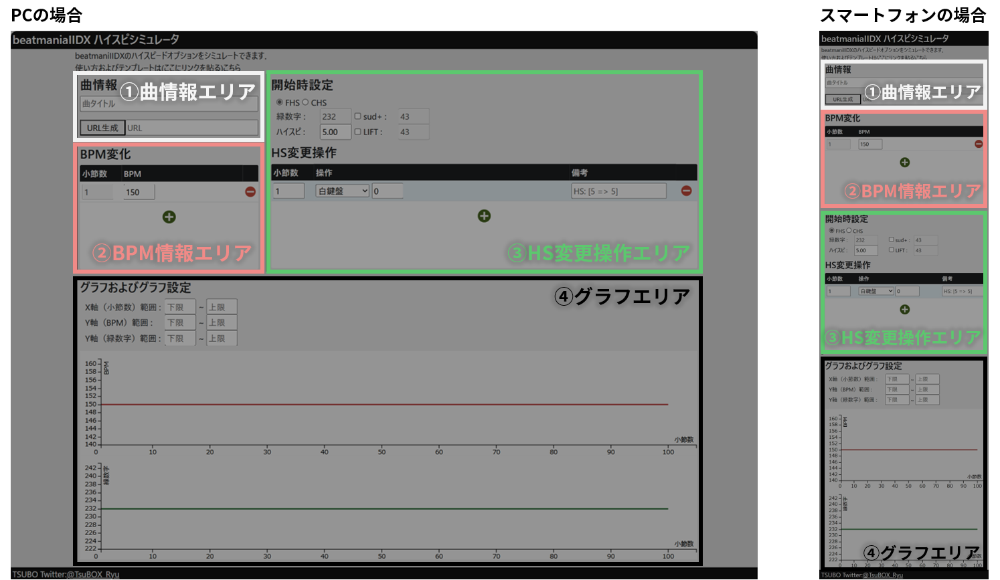

# beatmaniaIIDX High Speed Simulator

## Overview
beatmaniaIIDXのBPM変化および操作から，緑数字の変化を可視化できるシミュレータです．  
他のハイスピ計算機/シミュレータと比較して，以下の特徴があります : 
 - BPMおよび緑数字の変化が時系列グラフで表示されることで，ハイスピ変更操作のタイミングを検討しやすい．
 - 実際の操作と紐づいており，操作感がつかみやすい．
 - 作成したハイスピ変更操作をURLパラメータとして出力できるため，他の人と共有したりメモとして保存したりできる．

## Usage
### 画面説明
本シミュレータは，以下のエリアから構成されます．
1. 曲情報エリア  
1. BPM情報エリア  
1. HS変更操作エリア
1. グラフエリア

### シミュレーション方法
1. 曲情報エリアに，曲タイトルや補足情報を記載します．　　
   
2. BPM情報エリアに，BPMの変化点を入力します．+ボタンをクリックして行を追加し，BPMが変化する小節数と変化後のBPMを入力します．入力すると，入力値がグラフエリアに反映されます．また，1行目には開始時のBPMを入力します．  
   
3. HS変更操作エリアに，開始時のHS設定およびHS変更操作を入力します．  
   開始時設定：開始時のHS種別をFHSかCHSから選択します．また，Sudden+/Liftを使う場合は，それぞれsud+/Liftのチェックボックスをクリックし，白数字を入力します．FHSかつsud+かLiftにチェックが入っている場合は緑数字を，それ以外はハイスピードを入力します．  
   HS変更操作：+ボタンをクリックして行を追加し，HSの変更操作を行う小節数と操作内容を入力します．操作内容プルダウンメニューから選択し，操作によっては操作値を入力（以下の表を参照のこと）します．
   
   | 操作内容 | 実際の操作 | 入力値 |
   | :- | :- | :- |
   | 白鍵盤 | Start + 白鍵盤 | 鍵盤の押下回数 |
   | 黒鍵盤 | Start + 黒鍵盤 | 鍵盤の押下回数 |
   | Sud外し | Start 2回押し | - |
   | Sud付け | Start 2回押し | - |
   | ターンテーブル | Start + ターンテーブル | Sud/Lift使用時：白数字の差分   FHS+Sud/Lift未使用：HSの差分 |
   | HS切替 | Start + Effect | - |
   
   
4. グラフエリアに，グラフの表示範囲を入力します．
5. シミュレーション結果を共有する/保存する場合は，曲情報エリアの「URL生成」ボタンをクリックし，URLを生成します．（生成されたURLにアクセスすると，現状のページが表示されます．）
   

## Author
[@TsuBOX_Ryu](https://x.com/TsuBOX_Ryu/)

## Licence
